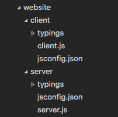

## jsconfig.json

> 用于帮助您的编辑器 Language Server (LSP)在您的项目文件夹中使用 javascript，源于 VsCode，但任何使用 LSP 的编辑器都会使用 jsconfig.json 包括 `VsCode`、`SublimeText` 等。

### 为什么我们需要一个 jsconfig.json 文件

Visual Studio Code 的 JavaScript 支持可以在两种不同的模式下运行：

- `文件范围` - 没有 jsconfig.json：在此模式下，在 Visual Studio Code 中打开的 JavaScript 文件被视为独立单元。 只要文件 a.js 没有显式引用文件 b.ts（使用///引用指令或 CommonJS 模块），两个文件之间就没有共同的项目上下文。
- `项目范围` - 使用 jsconfig.json：JavaScript 项目是通过 jsconfig.json 文件定义的。 目录中存在此类文件表示该目录是 JavaScript 项目的根目录。 文件本身可以选择列出属于项目的文件，要从项目中排除的文件，以及编译器选项（见下文）。

下图是一个带有 client 和 server 文件夹的项目，显示了两个独立的 JavaScript 项目。为了两个项目有不同的 IntelliSense，就需要设置 `jsconfig.json`。



### 最佳配置

```json
{
  "compilerOptions": {
    "baseUrl": "./", // 根路径
    "paths": {
      "@/*": ["./src/*"] // 路径映射，与 baseUrl 关联
    },
    "checkJs": true,
    "target": "ESNext",
    "module": "esnext",
    // 实验性选项
    "experimentalDecorators": true, // 启用实验性的ES装饰器
    "emitDecoratorMetadata": true, // 给源码里的装饰器声明加上设计类型元数据
    "allowSyntheticDefaultImports": false // 允许从没有默认导出的模块中默认导入
  }
}
```
