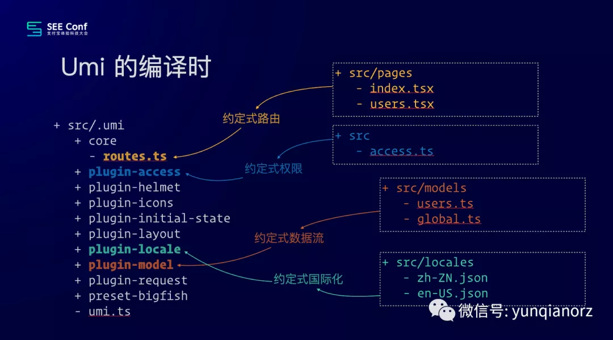
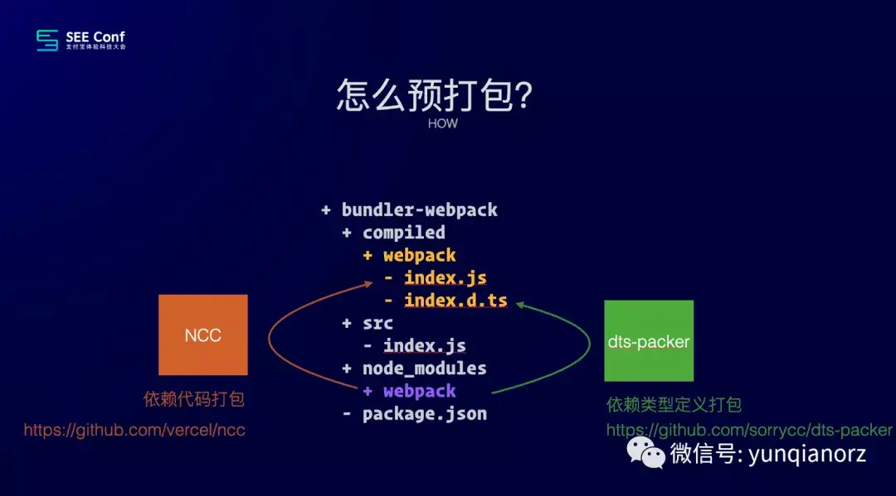
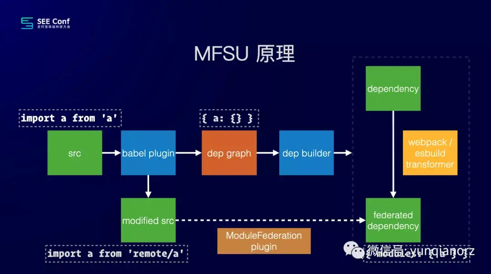

## 编译时框架

- 非编译时比如非常流行的 create-react-app，把源码简单直接地交给 webpack 就完成使命；
- 编译时框架则会自己加很多戏，比如拿到源码后做 ast 分析，拿到依赖图谱，做检查，生成临时文件，等等，最后把编译后的源码交给 webpack，这中间的很多事，本来是需要开发者手动处理或编码的。

> 比如服务端渲染的项目，按照目录创建文件，不用手动定义路由，就会生成规范的路由路径，不用开发者手动定义，都是因为框架本身也添加编译的功能，将编译好的代码再交给编译工具再次编译成最终运行的产物

Umi 做了很多编译时的事，如果你用过 umi，应该了解 src 下有个 .umi 临时目录，这里存放的文件本是需要开发者自己写的，现在由框架或插件在编译时自动生成。比如在 pages 目录下新建文件即是路由，新建 access.ts 文件即是权限，在 locales 目录下新建文件即是国际化语言，等等。

## 依赖预打包

> 将依赖的三方包直接编译成产物，供当前 library 使用，这样就能完完全全的锁定依赖，把依赖的 node 数从 1309 降到 314，这带来的不仅有安全和稳定，还有安装提速、node_modules 目录瘦身、命令行启动提速、无 peerDependency 警告等等，比如出名的服务端渲染框架[`next.js`](https://github.com/vercel/next.js/tree/canary/packages/next/compiled)就采用了这种手段。

### 如何实现依赖预打包

1. 将依赖的模块放到`devDependencies`里面，避免使用框架的人下载依赖
2. 将依赖打包到指定目录比如：`compiled/webpack`，生成一个 index.js 和 index.d.ts
3. 框架使用依赖的时候从编译好的目录下面寻找使用

:::danger 插件资源

1. [`@vercel/ncc`](https://github.com/vercel/ncc)：编译 Node.js 资源为单个文件，可查看[`umi-next.bundleDeps`](https://github.com/umijs/umi-next/blob/master/scripts/bundleDeps.ts)

:::

## 结合 module federation 加快 webpack 编译速度

> 原理是将应用的依赖构建为一个 Module Federation 的 remote 应用，以免去应用热更新时对依赖的编译，可以大幅减少热更新所需的时间，查看相关实现[`mfsu`](https://github.com/umijs/umi-next/tree/master/packages/mfsu)

实现步骤主要分为两步：

1. 修改源码，从 remote 获取资源
2. 收集依赖到依赖图谱；然后依赖图谱会通知 dep builder 做依赖的预编译，这里可以选 esbuild 或 webpack，产出的格式都是 module federation；最后修改后的源码会加载这份预编译后的依赖，形成 BI 环。

## 参考

- [Umi 4 设计思路文字稿](https://mp.weixin.qq.com/s/FTZ93pScf3gykd39voEpng)
