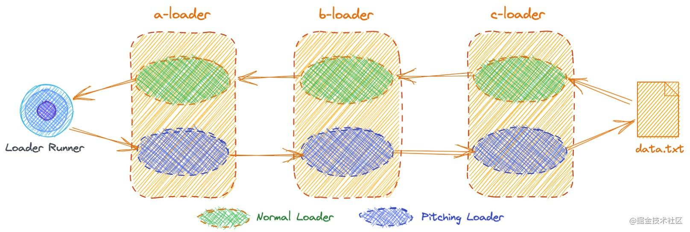
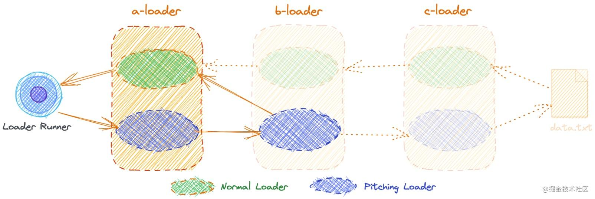

## Loader 类型

有两种 `loader`，他们主要的区别是：执行的时机不同。

- `normal loader`
- `pitching loader`

### 1、执行顺序

对于如下 `loader` 配置：

```javascript
module.exports = {
  module: {
    rules: [
      {
        use: ['a-loader', 'b-loader', 'c-loader']
      }
    ]
  }
}
```

- `loader` 总是 `从右到左` 被调用，但是执行 loader 之前，会先 从左到右 调用 loader 上的 `pitch` 方法。



- `pitching loader` 返回不为 `undefined` 值的时候，就会跳过剩下的 `loader`




下面我们一一介绍：

### 2、Normal Loader

`导出函数`的本体，就是 `normal loader`。

```javascript
/**
 * @param {string|Buffer} content 源文件的内容
 * @param {object} [map] 可以被 https://github.com/mozilla/source-map 使用的 SourceMap 数据
 * @param {any} [meta] meta 数据，可以是任何内容
 */
function webpackLoader(content, map?, meta?) {
  // 你的webpack loader代码
}
module.exports = webpackLoader
```

- `content`：源文件内容，或者是前一个 `loader` 返回的内容。
- `map`：源代码的 `sourcemap` 结构，第一个运行的 `loader`，可以自己生成 `sourcemap`，然后通过 `this.callback` 传递。
- `meta`：自定义数据，主要用于在 `loader链` 中传递数据。

:::success 知识点

- 默认是通过 `return data` 来返回数据，如果需要传递额外的参数，就需要用到 `callback` 来传递数据：

  ```javascript
  function beforeLoader(content) {
    const sourceMap = ''
    const meta = {
      id: 'beforeLoader'
    }

    this.callback(null, content, sourceMap, meta)
  }
  ```

- 关于类型提示，可以导入 `LoaderContext` 来解决 `this` 类型问题：

  ```javascript
  /** @typedef { import('webpack').LoaderContext<any> } LoaderContext */

  /** @this { LoaderContext } */
  function beforeLoader(content) {
    const sourceMap = ''
    const meta = {
      id: 'beforeLoader'
    }

    this.callback(null, content, sourceMap, meta)
  }

  module.exports = beforeLoader
  ```

:::

### 3、pitching loader

`导出函数` 上面的 `pitch` 函数，就是 `pitching loader`

```javascript
/**
 * @remainingRequest 剩余请求
 * @precedingRequest 前置请求
 * @data 数据对象
 */
function pitch (remainingRequest, precedingRequest, data) {
 // some code
};
```

为什么 `loader` 要有 `pitch` 阶段：

- 共享数据：传递给 pitch 方法的 data，在执行阶段也会暴露在 this.data 之下

  ```javascript
  module.exports = function (content) {
    return someSyncOperation(content, this.data.value);
  };

  module.exports.pitch = function (remainingRequest, precedingRequest, data) {
    data.value = 42;
  };
  ```

- 终止：如果某个 loader 在 pitch 方法中给出一个结果，那么这个过程会回过身来，并跳过剩下的 loader。比如：b-loader 的 pitch 方法返回了一些东西：


  ```javascript
  module.exports = function (content) {
    return someSyncOperation(content);
  };

  module.exports.pitch = function (remainingRequest, precedingRequest, data) {
    if (someCondition()) {
      return (
        'module.exports = require(' +
        JSON.stringify('-!' + remainingRequest) +
        ');'
      );
    }
  };
  ```

## 参考

1、[多图详解，一次性搞懂Webpack Loader](https://juejin.cn/post/6992754161221632030#heading-3)
2、[Webpack 原理系列七：如何编写loader](https://mp.weixin.qq.com/s?__biz=Mzg3OTYwMjcxMA==&mid=2247484137&idx=1&sn=bbf2bd1350a5cd362d3de59bd6f0ec69&chksm=cf00bf90f87736867d4c8b7da45dbb09cfe577014b3d4f2043d90ce2679548206647cc0ad1b4&mpshare=1&scene=1&srcid=0902zdOilxcpQ4LVMq11REF3&sharer_sharetime=1630560115000&sharer_shareid=dd3bb47266e2ae385f2e9fc9db95e4e4#rd)
3、[webpack Loader Interface](https://webpack.docschina.org/api/loaders/#pitching-loader)
