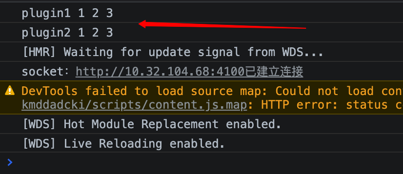
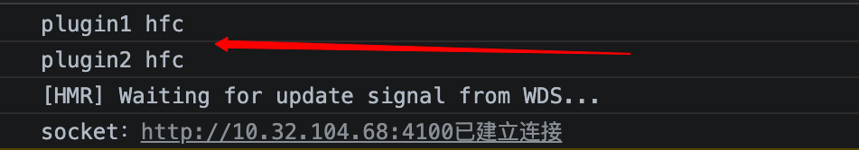
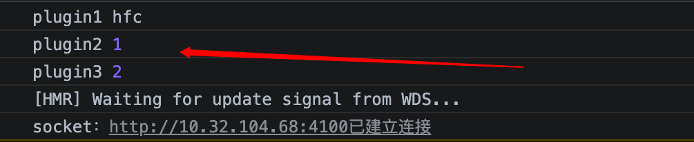
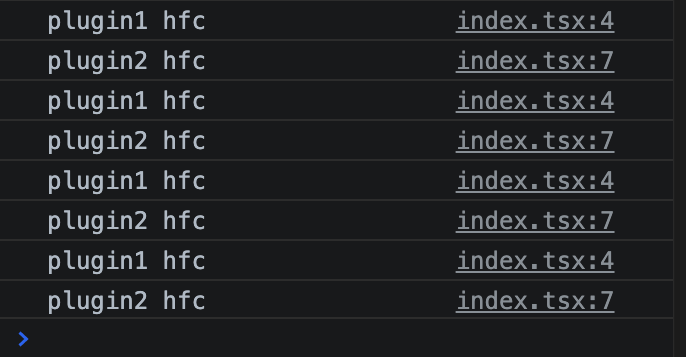
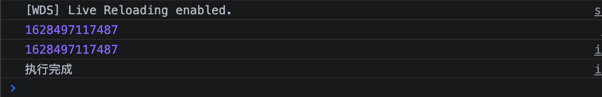
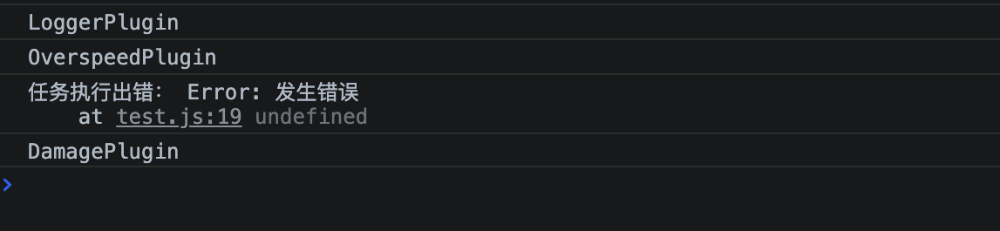
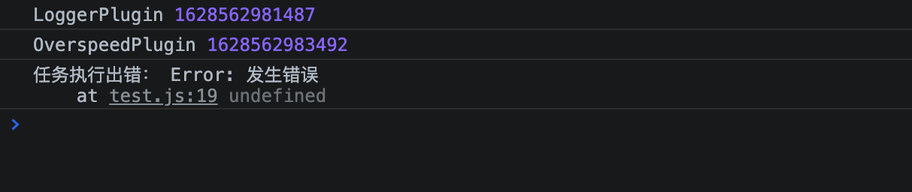
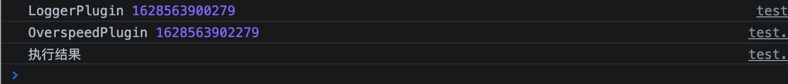
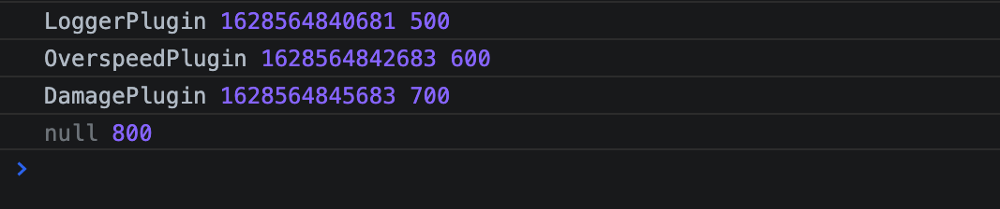

## 简介

- `tapable` 控制一系列注册事件之间的执行流机制，可以理解为高阶版的 `event`.
- 分为 `同步` 和 `异步`，然后 `异步` 里面又分为 `串行` 和 `并行`，当然 `同步` 的只能是 `串行`.

## sync 同步类型

### 1. SyncHook 钩子

- 按照注册的先后顺序执行
- 只能通过 `tap` 注册，`call` 触发事件

```tsx
import { SyncHook } from 'tapable'

const syncHook = new SyncHook<Array<string>>(['name', 'age', 'height'])

syncHook.tap('plugin1', (name, age, height) => {
  console.log('plugin1', name, age, height)
})

syncHook.tap('plugin2', (name, age, height) => {
  console.log('plugin2', name, age, height)
})

syncHook.call('1', '2', '3')
```

执行结果如下所示：



### 2. SyncBailHook 钩子

- `bail：[beɪl] 保释`
- 按照注册的先后顺序执行，前面如果有一个返回值不为空，则跳过剩余的事件。

```tsx {9}
import { SyncBailHook } from 'tapable'
const syncHook = new SyncBailHook(['name'])

syncHook.tap('plugin1', (name) => {
  console.log('plugin1', name)
})
syncHook.tap('plugin2', (name) => {
  console.log('plugin2', name)
  return 'name'
})
syncHook.tap('plugin3', (name) => {
  console.log('plugin3', name)
})

syncHook.call('hfc')
```

第二个注册事件因为返回了不为 `undefined` 的值，所以后面的事件不会继续执行，运行结果如下所示：



### 3. SyncWaterfall 钩子

- `waterfall：[ˈwɔːtəfɔːl] 瀑布`
- 串行执行，上一个事件的返回值，会传递给下一个事件

```tsx
import { SyncWaterfallHook } from 'tapable'
const syncHook = new SyncWaterfallHook(['name'])

syncHook.tap('plugin1', (name) => {
  console.log('plugin1', name)
  return 1
})
syncHook.tap('plugin2', (name) => {
  console.log('plugin2', name)
  return 2
})

syncHook.tap('plugin3', (name) => {
  console.log('plugin3', name)
})

syncHook.call('hfc')
````

运行结果如下入所示：



### 4. SyncLoopHook 钩子

- 事件只要有返回值，就会一直循环 `该事件之前注册的所有事件，以及该事件`

```tsx {9}
import { SyncLoopHook } from 'tapable'
const syncHook = new SyncLoopHook(['name'])

syncHook.tap('plugin1', (name) => {
  console.log('plugin1', name)
})
syncHook.tap('plugin2', (name) => {
  console.log('plugin2', name)
  return 2
})

syncHook.tap('plugin3', (name) => {
  console.log('plugin3', name)
})

syncHook.call('hfc')
```

执行结果，如下图所示：



## async 异步钩子

### 1. AsyncParallelHook 钩子

- `parrallel：[ˈpærəlel] 平行的；相同的`
- 异步并行钩子

```tsx
import { AsyncParallelHook } from 'tapable'

const syncHook = new AsyncParallelHook(['name'])

syncHook.tapAsync('plugin1', (name, done) => {
  setTimeout(() => {
    console.log(new Date().getTime())
    done()
  }, 1000)
})
syncHook.tapAsync('plugin2', (name, done) => {
  setTimeout(() => {
    console.log(new Date().getTime())
    done()
  }, 1000)
})

syncHook.callAsync('hfc', () => {
  console.log('执行完成')
})
```

执行结果如下图所示：



可以看到两个事件打印的时间是相同的，说明是同一时刻执行注册 `setTimemout` 事件

### 2. AsyncParallelBailHook 钩子

- 前面已经看了 `SyncBailHook`，知道带 `Bail` 的功能就是当一个任务返回不为 `undefined` 的时候，阻断后面任务的执行。但是由于  `Parallel` 任务都是同时开始的，阻断是阻断不了了，实际效果是如果有一个任务返回了不为 `undefined` 的值，最终的 `回调会立即执行` ，并且获取 `Bail` 任务的返回值。

```tsx {15}
const { AsyncParallelBailHook } = require('tapable')
const accelerate = new AsyncParallelBailHook(['newSpeed'])

accelerate.tapAsync('LoggerPlugin', (newSpeed, done) => {
  setTimeout(() => {
    console.log('LoggerPlugin')
    done()
  }, 1000)
})

accelerate.tapAsync('OverspeedPlugin', (newSpeed, done) => {
  // 2秒后检测是否超速
  setTimeout(() => {
    console.log('OverspeedPlugin')
    done(new Error('发生错误'), '执行结果')
  }, 2000)
})

accelerate.tapAsync('DamagePlugin', (newSpeed, done) => {
  setTimeout(() => {
    console.log('DamagePlugin')
    done()
  }, 3000)
})

accelerate.callAsync(500, (error, data) => {
  if (error) {
    console.log('任务执行出错：', error, data)
  } else {
    console.log('任务全部完成', data)
  }
})
```

执行结果，如下图所示：



:::warning
要注意的是：方法的返回值，第一个是 `error`，第二个是事件的返回值，如果 `error` 有值，那么 `data` 就没有值
:::

### 3. AsyncSeriesHook 钩子

- `series：[ˈsɪəriːz]：连续`
- 异步串行钩子

```tsx {13}
const { AsyncSeriesHook } = require('tapable')
const accelerate = new AsyncSeriesHook(['newSpeed'])

accelerate.tapAsync('LoggerPlugin', (newSpeed, done) => {
  setTimeout(() => {
    console.log('LoggerPlugin', Date.now())
    done()
  }, 1000)
})
accelerate.tapAsync('OverspeedPlugin', (newSpeed, done) => {
  setTimeout(() => {
    console.log('OverspeedPlugin', Date.now())
    done(new Error('发生错误'), '执行结果')
  }, 2000)
})
accelerate.tapAsync('DamagePlugin', (newSpeed, done) => {
  setTimeout(() => {
    console.log('DamagePlugin', Date.now())
    done()
  }, 3000)
})

accelerate.callAsync(500, (error, data) => {
  if (error) {
    console.log('任务执行出错：', error, data)
  } else {
    console.log('任务全部完成', data)
  }
})
```

执行结果，如下图所示：



:::warning
可以看到前面的事件如果抛出错误，后续的事件将不再执行而且最终的回调会立即执行。
:::

### 4. AsyncSeriesBailHook 钩子

- 异步串行钩子加上了 `bail` 的逻辑，任何一个事件返回了不为 `undefined` 那么后续的事件不再执行，直接执行最终结果。

```tsx {15}
const { AsyncSeriesBailHook } = require('tapable')

const accelerate = new AsyncSeriesBailHook(['newSpeed'])

accelerate.tapAsync('LoggerPlugin', (newSpeed, done) => {
  setTimeout(() => {
    console.log('LoggerPlugin', Date.now())
    done()
  }, 1000)
})

accelerate.tapAsync('OverspeedPlugin', (newSpeed, done) => {
  setTimeout(() => {
    console.log('OverspeedPlugin', Date.now())
    done('执行结果')
  }, 2000)
})

accelerate.tapAsync('DamagePlugin', (newSpeed, done) => {
  setTimeout(() => {
    console.log('DamagePlugin', Date.now())
    done()
  }, 3000)
})

accelerate.callAsync(500, (data) => {
  console.log(data)
})
```



### 5. AsyncSeriesWaterfalHook 钩子

- 异步串行钩子，加上了 `waterfal` 逻辑，前面事件的返回值，会返回给后面的事件

```tsx
const { AsyncSeriesWaterfallHook } = require('tapable')

const accelerate = new AsyncSeriesWaterfallHook(['newSpeed'])

accelerate.tapAsync('LoggerPlugin', (result, done) => {
  setTimeout(() => {
    console.log('LoggerPlugin', Date.now(), result)
    done(null, result + 100)
  }, 1000)
})

accelerate.tapAsync('OverspeedPlugin', (result, done) => {
  setTimeout(() => {
    console.log('OverspeedPlugin', Date.now(), result)
    done(null, result + 100)
  }, 2000)
})

accelerate.tapAsync('DamagePlugin', (result, done) => {
  setTimeout(() => {
    console.log('DamagePlugin', Date.now(), result)
    done(null, result + 100)
  }, 3000)
})

accelerate.callAsync(500, (error, data) => {
  console.log(error, data)
})
```

执行结果，如下图所示：


