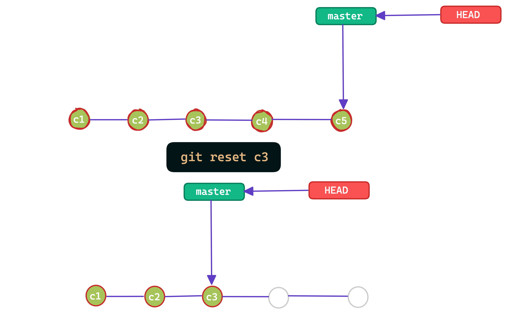
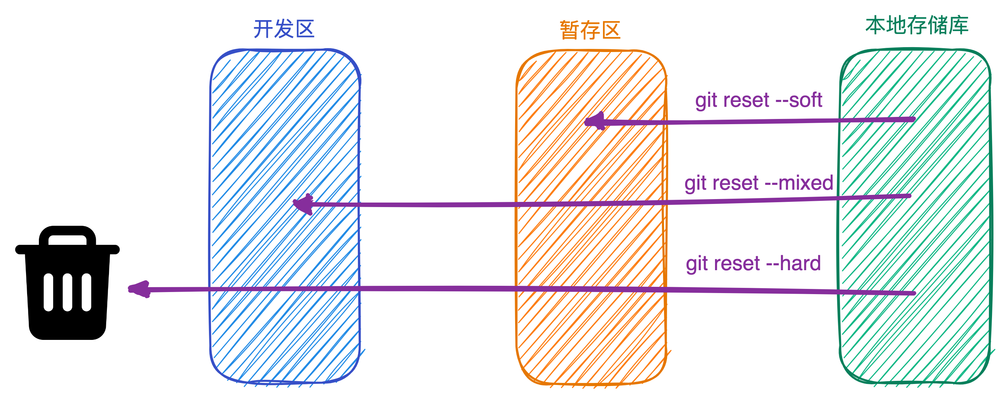

## git reset

> `reset：重置；清零`，命令将会移动`HEAD`指针到指定的 commit，这个 commit 之后的 commit 被清除掉



:::danger
一般用来撤销`未被提交到远程存储库`的操作，因为一旦提交到远程存储库，远程存储库的 commit 肯定是包含本地存储库的 commit，使用会需要`git pull`的操作，又会被还原回去
:::

### git reset --soft

一共三个档次的标记，`soft：柔软的`作为第一档，清除之后 commit 的同时，将发生改动的文件存放到`暂存区`

### git reset --mixed (default)

一共三个档次的标记，`mixed：混合的`作为第二档，清除之后 commit 的同时，将发生改动的文件存放到`已修改区`

### git reset --hard

一共三个档次的标记，`hard：强硬的`作为第三档，清除之后 commit 的同时，将发生改动的文件`直接丢弃`



## git revert

> `revert：复原`，创建一个新的 commit 来撤销`一次commit`所做出的修改，这种撤销的方式是安全的，因为它并不修改 commitm history


## git checkout

> `git checkout commit`，可以将 HEAD 指向这个 commit，然后针对当时这个 commit 时的状态继续操作，操作完成之后可以创建一个分支保存

为什么说是`游离状态`修改，可以作为实验性某个功能来操作，因为当前分支肯定是包含了游离状态的 commit，针对这么 commit 的所有操作，照理说都可以直接在当前分支最后的一个 commit 来操作

## git reset, revert, check 区别

1、git reset 和 git check 可以作用于文件级别，git revert 只能作用于 commit 级别

:::danger

```shell title="针对index.txt重置到commitID时的状态"
git reset commitID index.txt
```

不能使用`--hard`标识符，因为针对文件级别的操作，肯定是不能丢弃 commit 的，修改完 index.txt 需要提交一个新的 commit
:::
