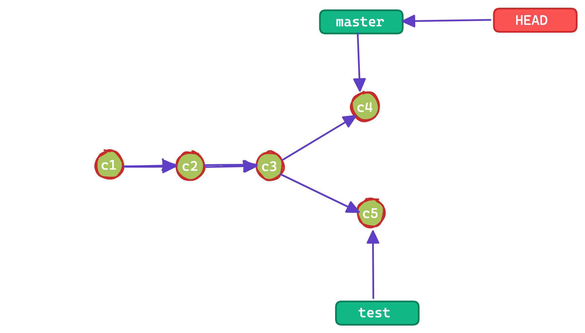

## git vs svn

> `git`是一个分布式版本管理工具，`svn`是一个集中式版本管理工具

- `集中式`：系统将所有文件和历史数据存储在中央服务器上，提交更改时直接修改中央服务器。
- `分布式`：每个用户都有一个本地存储库，然后服务器上有一个存储库，每个用户先将代码提交到本地存储库，然后将本地存储库推送到远程存储库。


## 重要概念

### 文件状态

> 在 Git 中文件大概分为三种状态：已修改（modified）、已暂存（staged）、已提交（committed）

- `修改`：Git 可以感知到工作目录中哪些文件被修改了，然后把修改的文件加入到 modified 区域
- `暂存`：通过 add 命令将工作目录中修改的文件提交到暂存区，等候被 commit
- `提交`：将暂存区文件 commit 至 Git 目录中永久保存


### commit 节点

> 每次执行`git commit`就会生成一个节点，这就是 commit 节点

在 git 中每次执行`git commit`就会根据提交的内容通过 SHA1 计算内容的哈希值，多次提交就会形成一个线性节点链


:::danger
后面的 commit 节点包含前面的 commit 节点：也就是`commit3`包含`commit2`和`commit1`的内容
:::

### HEAD

> HEAD 是 Git 中非常重要的一个概念，你可以称它为指针或者引用，它可以指向任意一个节点，并且指向的节点始终为当前工作目录，换句话说就是当前工作目录(也就是你所看到的代码)就是 HEAD 指向的节点

:::danger

- 可以这样理解：分支本质上就是指向 commit 的指针，但是呢分支会有多个，git 需要知道你当前在哪个分支上面工作，所有就有了 HEAD
- 本质上 HEAD 就是 git 用来知道用户当前在哪个节点工作，默认情况下都是指向分支的指针



:::

:::info 调试步骤

- 查看当前`HEAD`的指向：`cat .git/HEAD`

```shell title="HEAD指针指向了另一个文件：refs/heads/master"
ref: refs/heads/master
```

- 查看`refs/heads/master`文件的内容：`cat .git/refs/heads/master`

```shell title="指向一个commit"
262715af460ffe2bdd0bfa8b21014248f1dbaa4b
```

- 证实了上面 HEAD → branch → commit

:::

### 分离状态

> `HEAD`默认指向分支指针，如果`HEAD`直接指向某个 commit 的时候就是`分离状态`

```shell
git checkout 62f1f045395b3ce1db323b70733323e3f277906a
```

### 分离状态的使用场景

> `git checkout commitID` 分离状态可以基于当前 commit 做代码的修改，最后决定使用这些 commit 的时候可以创建一个分支保留

- `git checkout 62f1f045395b3ce1db323b70733323e3f277906a`
- `git add newfile`
- `git checkout -b new_branch`

## 参考

- [图解 git](https://marklodato.github.io/visual-git-guide/index-zh-cn.html)
- [Git 各指令的本质，真是通俗易懂啊](https://mp.weixin.qq.com/s?__biz=MzU1OTgxNDQ1Nw==&mid=2247490189&idx=1&sn=9fdfc612e777c03be1f162c86ae2b8c8&chksm=fc10d8dbcb6751cd12f9cfff9a4761d2da4b7097a3187decccdc1398e7489a719255be041058&mpshare=1&scene=1&srcid=1222N6Pgddf8YraShUAEr35d&sharer_sharetime=1640158251444&sharer_shareid=dd3bb47266e2ae385f2e9fc9db95e4e4&version=3.1.20.90367&platform=mac#rd)
