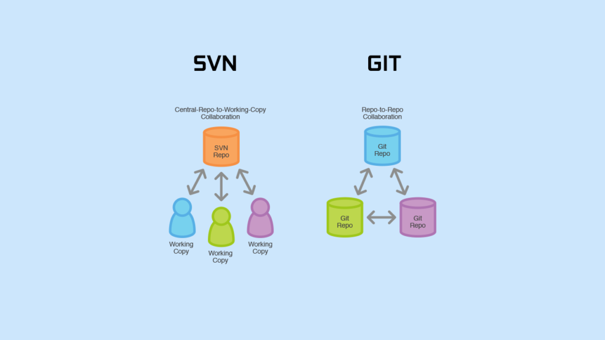
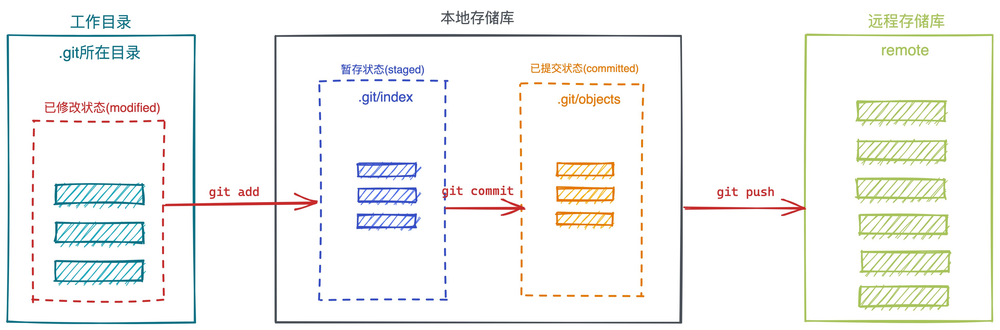
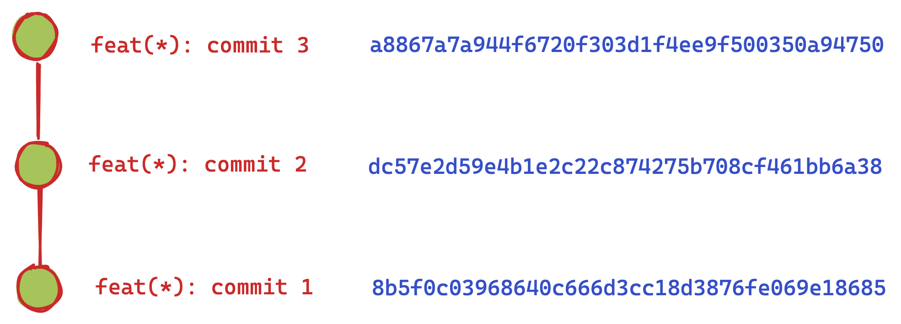

## git vs svn

> `git`是一个分布式版本管理工具，`svn`是一个集中式版本管理工具

- `集中式`：系统将所有文件和历史数据存储在中央服务器上，提交更改时直接修改中央服务器。
- `分布式`：每个用户都有一个本地存储库，然后服务器上有一个存储库，每个用户先将代码提交到本地存储库，然后将本地存储库推送到远程存储库。

## 重要概念

### 文件状态

> 在 Git 中文件大概分为三种状态：已修改（modified）、已暂存（staged）、已提交（committed）

- `修改`：Git 可以感知到工作目录中哪些文件被修改了，然后把修改的文件加入到 modified 区域
- `暂存`：通过 add 命令将工作目录中修改的文件提交到暂存区，等候被 commit
- `提交`：将暂存区文件 commit 至 Git 目录中永久保存

### commit 节点

> 每次执行`git commit`就会生成一个节点，这就是 commit 节点

在 git 中每次执行`git commit`就会根据提交的内容通过 SHA1 计算内容的哈希值，多次提交就会形成一个线性节点链

:::danger
后面的 commit 节点包含前面的 commit 节点：也就是`commit3`包含`commit2`和`commit1`的内容
:::
