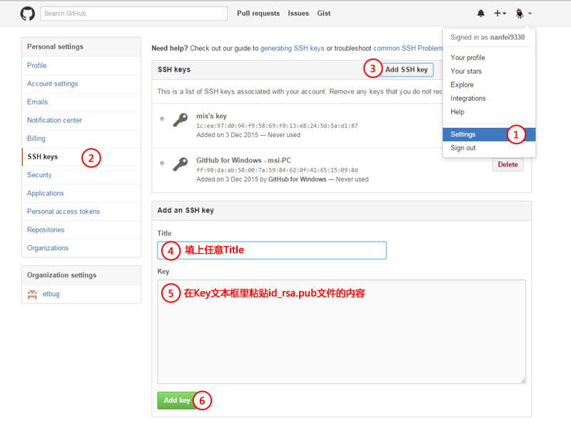

## 步骤

> 通过`SSH`来管理多个账号

### 第一步： 生成 SSH Key

> 为每个账号生成`SSH Key`

```shell
ssh-keygen -t rsa -C "注册邮箱"
```

### 第二步：将公钥添加到对应github账号下

1. 获取`key`：打开 .ssh 下的 id_rsa.pub 文件，里面的内容就是 key 的内容

```shell
start ~/.ssh/id_rsa.pub
```

2. 登录`github`，打开[SSH Keys](https://github.com/settings/keys)页面



### 第三步：配置`~/.ssh/config`文件：

```yml
# Default github user(anijs6)
// highlight-next-line
Host github.com
HostName github.com
User anijs6
IdentityFile ~/.ssh/id_rsa_github_anijs6

# gitlab user(找钢)
# 建一个gitlab别名，新建的帐号使用这个别名做克隆和更新
Host git.zhaogangren.com
HostName git.zhaogangren.com
User haifeng.cui
IdentityFile ~/.ssh/id_rsa_gitlab_zhaogang

# Default github user(hfc-advance)
// highlight-next-line
Host hfc-advance.github.com
HostName github.com
IdentityFile ~/.ssh/id_rsa_hfc-advance
User 崔海峰
```

:::danger
可以看到当有多个账号的时候，`HostName`是相同的，但是`Host`需要区分开，这里通过`remote作用域`来区分，添加了`remote作用域`之后就需要设置拉取下来的项目的作用域：

```shell
#第一步：移除remote
git remote rm origin
# 第二步：添加带有作用域的remote
git remote add origin git@hfc-advance.github.com:hfc-advance/normal.git
# 第三步：将配置推到remote
git push origin master
```

:::

### 第四步：设置每个项目自己的user.email

```shell
# 取消global
git config --global --unset user.name
git config --global --unset user.email
# 设置每个项目自己的user.email
git config  user.name "suzie"
git config  user.email "xxxx@xx.com"
```
