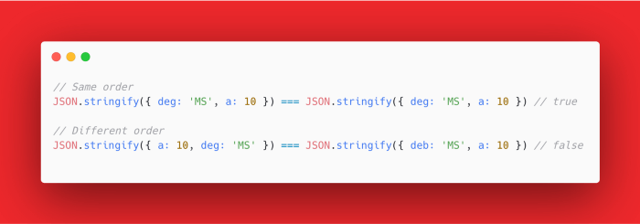

## 对象转字符串

### 使用 JSON.stringify

因为对象是无序的，但是字符串是有序的，所以直接使用 `JSON.stringify` 会有问题：



### 使用 JSON.stringify + sort

```ts {8}
function objectToString(obj: { [k: string]: unknown }): string {
  const { hasOwnProperty } = Object.prototype
  let result = ''
  const keys = []
  for (const k in obj) {
    if (hasOwnProperty.bind(obj, k)) keys.push(k)
  }
  keys.sort()
  for (let i = 0; i < keys.length; i++) {
    result = `${result + keys[i]}=${obj[keys[i]]}`
  }
  return result
}
```

:::important
能够预知对象的顺序不会变的时候，可以使用简单粗暴的 `JSON.stringify` 来判断对象是否相等，在复杂的环境就需要遍历成字符串，并且按照同样的排序规则来排序判断。
:::
