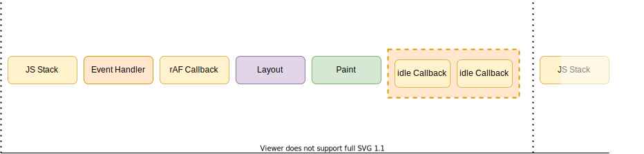

## 事件循环过程

<div style={{ backgroundColor: '#FFFFFF' }}>
  
</div>

### 每一帧的执行过程

<div style={{ backgroundColor: '#FFFFFF' }}>


</div>

1. 执行主线程 `js stack`。
2. 执行监听事件的 `Handler`以及数据请求 `response`， 比如：`（inputEvent, clickEvent, scrollEvent）`。
3. 执行 `requestAnimationFrame` 的回调函数。
4. `Layout`。
5. `Paint`。
6. 如果当前帧还有空闲时间，执行 `requestIdleCallback` 回调函数。

```javascript
const now = performance.now()
document.addEventListener('click', () => {
  console.log('click-handler')
})
setTimeout(() => {
  console.log('timeout')
})
while (performance.now() - now < 5000) {}
void Promise.resolve()
  .then(() => {
    console.log('micro-task')
  })
requestAnimationFrame(() => {
  console.log('requestAnimationFrame1')
  requestAnimationFrame(() => {
    console.log('requestAnimationFrame2')
  })
})
```

:::success
打印结果依次是：micro-task，click-handler，requestAnimationFrame1，requestAnimationFrame2，timeout

- `微任务` 属于 `JS Stack` 过程，一旦主线程 `js` 执行完毕，立即检验 `微任务队列` 会把所有的微任务执行完毕，然后继续往下走。
- 并不会在每一帧遍历 `宏任务队列`，所以 `setTimeout` 的执行时机并不确定。
:::

<video controls autoplay>
  <source src={require('../../static/img/e_loop.mp4').default} type="video/mp4"></source>
</video>
