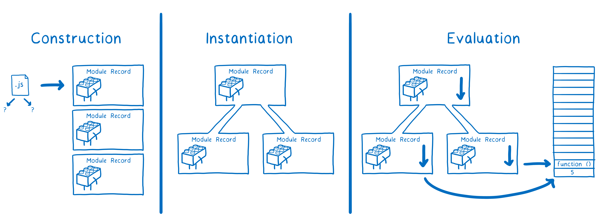
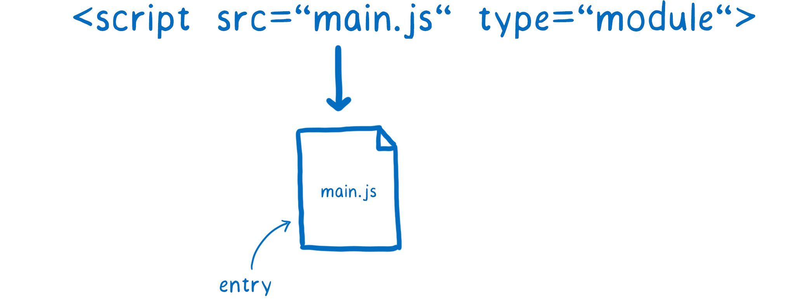

## 原理

> `javascript`是一门`解释执行`语言，也就是`javascript引擎`边编译边执行。

`JS 引擎`对脚本静态分析的时候，遇到模块加载命令 `import`，就会生成一个`只读引用`。等到脚本真正执行时，再根据这个只读引用，到被加载的那个模块里面去取值。

对于 ES modules 来说，这个过程需要三步：

1. `构建`：查找、下载以及将所有文件解析进入模块记录。
2. `实例化`：查找暴露出的值应该放在内存中的哪个位置(但是不会给它们填充值)，然后使`exports`和`imports`都指向内存中的这些盒子。这就是所谓的链接。

   > 实例化步骤也正好说明了：`ES Module`导入和导出都是执行的同一个引用，也就是导出模块的`原始值`变了，导入的值也会发生改变
3. `求值`：运行代码，把内存中变量赋值。

### 构建阶段

构建阶段每一个模块发生了三件事。

1. 判断应该从何处下载文件所包含的模块（又叫模块解决方案）
2. 获取文件（通过 url 下载 或者 通过文件系统加载）
3. 将文件解析进模块记录

### 构建阶段：查找文件并下载

- 模块加载器首先要找到入口文件。在`HTML`中，通过`<script type="module">`标签告诉加载器入口文件在哪里

   

- `import` 语句的一个部分被称为模块指定器。它告诉加载器在哪里可以找到每个下一个模块。

   

- 文件下载的时候会堵塞其他任务的进行

   > 在还没有将文件下载下来之前，浏览器是无法解析文件的，这就意味着浏览器必须逐层下载文件，解析文件，弄清每个文件的依赖关系，然后去下载这些依赖关系。

   

:::danger

- 这就是`ES模块规范`将算法分成多个阶段的原因之一：将`构建`分割成单独的一个阶段，这样就可以避免`实例化`这个同步步骤耗时太长，减慢建立模块关系图的时间。
- 在`CommonJS`规范中可以在模块加载器中使用变量，但是在`ES Module`中，因为要在`构建阶段`就建立好模块依赖关系图，这意味着不能在模块指定器里有变量，因为这些变量还没有值。

   
- `动态导入`：有时使用变量来表示模块路径真的很有用。例如，你可能想根据代码正在做什么或在什么环境下运行，来切换你加载的模块。为了使ES模块能够做到这一点，有一个建议叫做[`动态导入`](https://github.com/tc39/proposal-dynamic-import)。有了它，你可以使用 "import(\`${path}/foo.js\`)" 这样的导入语句。
   - 原理： 任何使用 `import()` 加载的文件都被处理为一个独立关系图的入口。动态导入的模块会启动一个新的模块关系图，这个关系图被单独处理。

   

:::

### 构建阶段：解析

现在我们已经获取了这个文件，我们需要把它解析成一个模块记录。这可以帮助浏览器了解模块的不同部分是什么。

一旦这条模块记录被创建，它将会被放置到模块映射集合内。这就意味着，无论何时它再次被请求，加载器都会从映射集合中录取它，而不会重新加载。 

### 实例化

1. 实例化阶段引擎会采用`深度优先后续遍历`的算法：引擎会深入的依赖关系图的最底部，也就是这个模块不依赖其他东西了，然后设置这个模块的`exports`也就是将`exports`连接到内存中

2. 引擎连接好一个模块的所有`exports`之后，就上升一级，到这一级也就是父级先连接所有的`imports`，然后再连接好自身模块的所有`exports`，如此循环下去一直到最顶级。

整个步骤如下图所示：

:::danger
所以依赖的导出和导入连接的都是内存中的同一块区域，`ES Module`使用的是一种叫做实时绑定的东西。两个模块都指向内存中的同一位置。这意味着，当输出模块改变一个值时，这个改变会在导入模块中显示出来。
:::

### 求值

> 求值：`JS`引擎通过执行函数外面的代码，来达到赋值的作用。

模块`map`通过`模块的 URL`会缓存该模块，也就是说每个模块只会有一个结果。

## 参考

- [ES modules: A cartoon deep-dive](https://hacks.mozilla.org/2018/03/es-modules-a-cartoon-deep-dive/?utm_source=JavaScriptReport&utm_medium=email&utm_campaign=JavaScriptReportWeekly)
