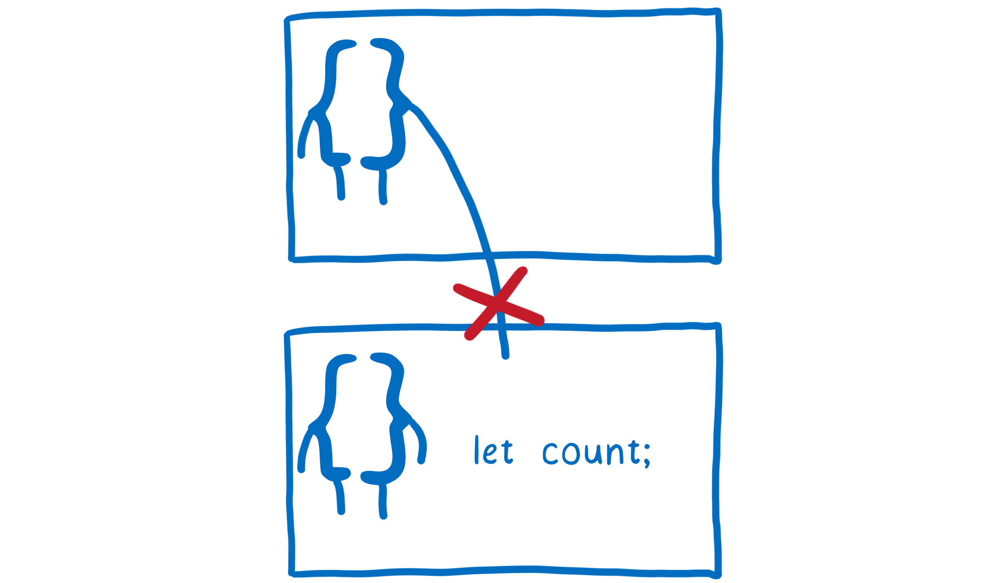
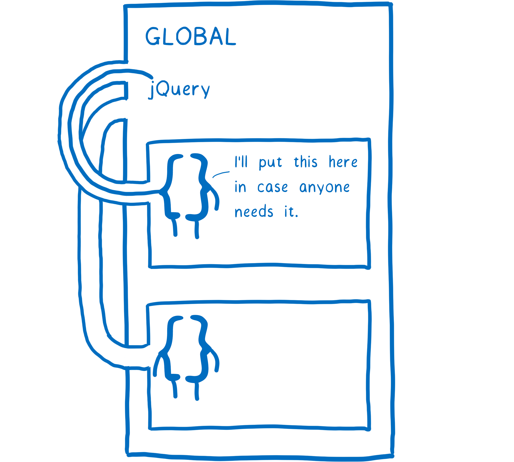
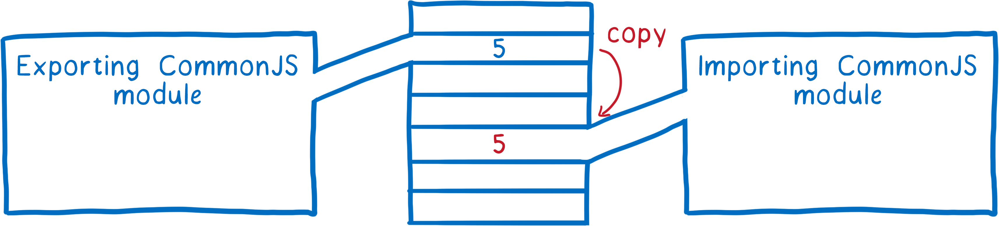

## 为什么会有模块化

> 一句话概括：限制作用域的同时，还可以明确的安排自己作用域内的哪些数据能够提供给别的作用域使用。

一次只需要考虑几个变量，事情就会变得简单。`JavaScript` 有一种方法来帮助你做到这一点，叫做`作用域`。由于作用域在 `JavaScript` 中的工作方式，函数不能访问在其他函数中定义的变量<div class="line-space-normal"></div>
这很棒！这意味着当你在一个函数中编码时，你只需要考虑当前这个函数了。你不必再担心其他函数可能会对你的变量做什么了。<div class="line-space-normal"></div>
虽然是这样没错，但是它也有不好的地方。这会让你很难去在不同的函数之间去共享变量。

要解决这个问题，于是就会提升变量到更高一层的作用域，甚至到全局作用域。

> 比如早期使用 `Jquery` 的时候，在你使用 `jQuery API` 之前，你不得不去把 `jQuery` 引入到全局作用域。



虽然解决了作用域共享数据的问题但是又出现了新的问题：

- 脚本模糊依赖前置脚本，也就是要求你的 `<script>` 标签必须按照严格的顺序摆放。否则依赖的变量就可能找不到导致语法错误。
- 变量存在于全局作用域，并且是允许修改的，那么有可能有些代码就会破坏你原有的逻辑，而且你还不知道是哪里出现问题的。

## 模块化是如何解决的

### CommonJS

- 首先每个文件也就是每个模块会被包裹在一个闭包函数：解决了作用域的问题：

  ```javascript
  (function (exports, require, module, __filename, __dirname) {
    // 模块源码
  });
  ```

- 每个文件导出的值会被存储在文件的`exports`变量上，当一个文件依赖另一个文件调用`require`时候，就会将依赖文件的`exports`变量上值`拷贝一份`作为调用`require`函数的返回结果：这样就解决了局部作用域内变量共享的问题

  

:::danger
注意的是这里的拷贝实际上是`浅拷贝`：也就是基础数据类型，两个模块随意修改都不会影响，但是修改引用类型就会影响

```javascript
// item.js
let a = 'item'
const obj = { name: '崔海峰'}
function changeValue() {
  obj.name = '小崔'
  a = 'a-changed'
}
module.exports = {
  obj,
  a,
  changeValue
}

// index.js
const { obj, changeValue, a } = require('./item.js')
console.log(obj, a) // { name: '崔海峰' } item
changeValue()
console.log(obj, a) // { name: '小崔' } item

```

可以看到基础数据类型`a`修改后的之后不影响导入模块的`a`的值，但是引用类型`obj`就会相互影响
:::

### ES Module

