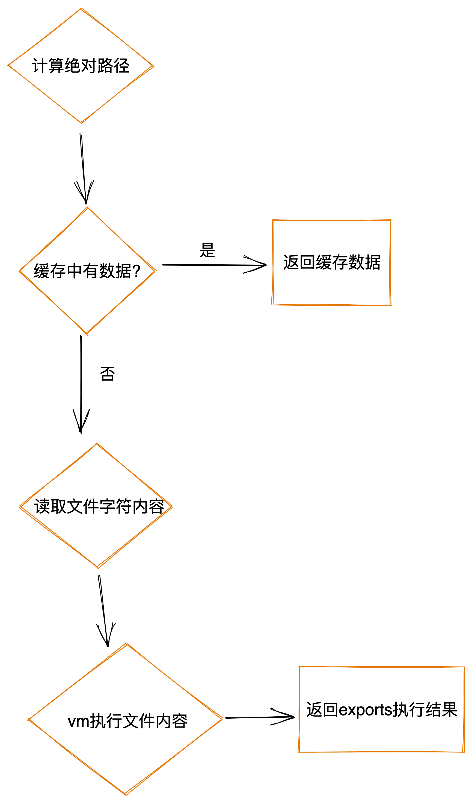

## require 执行过程

> [node:module](https://github.com/nodejs/node-v0.x-archive/blob/v0.12.7-release/lib/module.js) 源码



```javascript
// item.js
module.exports = 'item'

// index.js
const item = require('item')
```

##  重要知识点

### require更多类型的文件

> `require`默认只支持两种类型文件：`.js`、`.json`，如果想拓展可以通过`Module._extensions`来拓展：

```javascript title="Node.JS源码实现"
Module._extensions['.js'] = function(module, filename) {
  var content = fs.readFileSync(filename, 'utf8');
  module._compile(stripBOM(content), filename);
};

Module._extensions['.json'] = function(module, filename) {
  var content = fs.readFileSync(filename, 'utf8');
  try {
    module.exports = JSON.parse(stripBOM(content));
  } catch (err) {
    err.message = filename + ': ' + err.message;
    throw err;
  }
};
```

比如`require ts`文件：

```javascript
Module._extensions['.ts'] = function(module, filename) {
  var content = fs.readFileSync(filename, 'utf8');
  module.exports = esbuild.build({ entryPoints: [filename] })
};
```

### require并不是全局的而是注入模块内部的

```javascript
var runInThisContext = require('vm').runInThisContext;

// 读取文件字符串内容之后通过_compile内容来执行字符串内容
Module.prototype._compile = function(content, filename) {
  var compiledWrapper = runInThisContext(wrapper, { filename: filename });
    if (global.v8debug) {
      if (!resolvedArgv) {
        if (process.argv[1]) {
          resolvedArgv = Module._resolveFilename(process.argv[1], null);
        } else {
          resolvedArgv = 'repl';
        }
      }

      // Set breakpoint on module start
      if (filename === resolvedArgv) {
        global.v8debug.Debug.setBreakPoint(compiledWrapper, 0, 0);
      }
    }
    // highlight-start
    var args = [self.exports, require, self, filename, dirname];
    return compiledWrapper.apply(self.exports, args);
    // highlight-end
}
```

:::tip

- `_compile`函数最后用来编译读取的文件字符串内容

- `compiledWrapper.apply(self.exports, args)` 相当于自动执行一个闭包函数，而且注入了模块的全局变量`exports`、`require`、`module`等等：

  ```javascript 相当于下面的代码
  (function (exports, require, module, __filename, __dirname) {
    // 模块源码
  });
  ```

:::
