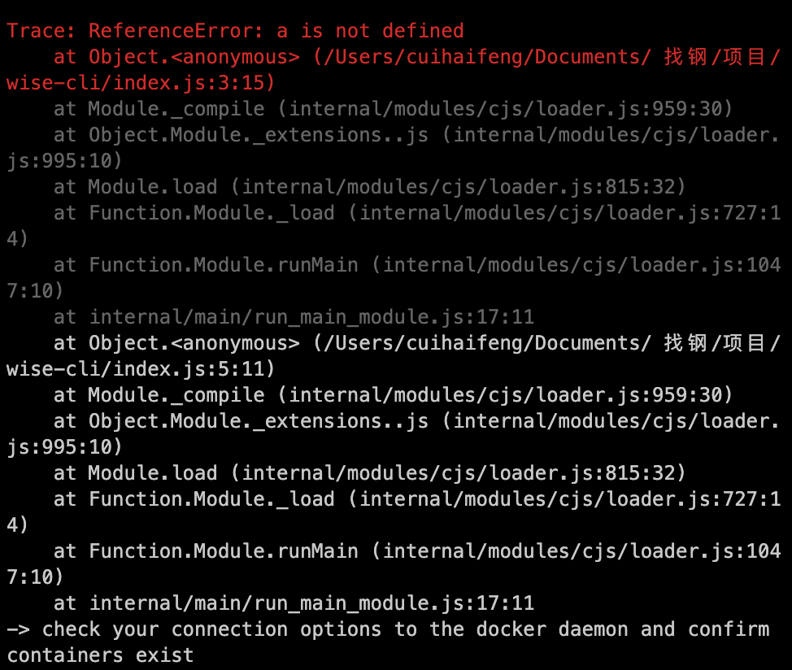

1. 着重显示`错误消息及文件`, 并抛出 `trace`

```javascript
function exitError (err) {
  cli.showUsage()

  if (err && err.message) {
    console.log('\x1b[31m')
    console.trace(err)

    if (err.message === 'Unable to determine the domain name') {
      console.log('-> check your connection options to the docker daemon and confirm containers exist')
    }
    console.log('\x1b[0m')
  }

  process.exit(-1)
}
```



:::warning

- 捕获到错误，要使用正确的退出代码，否则后续程序将按照正常的流程继续往下走。

  ```javascript {6}
  try {
    console.log(a)
  } catch (err) {
    exitError(err)

    process.exit(1)
  }
  ```

  - `0` 表示成功
  - `1` 表示失败

:::
