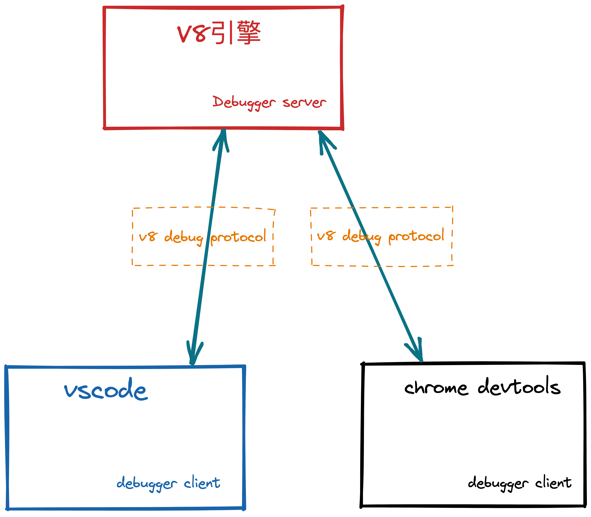
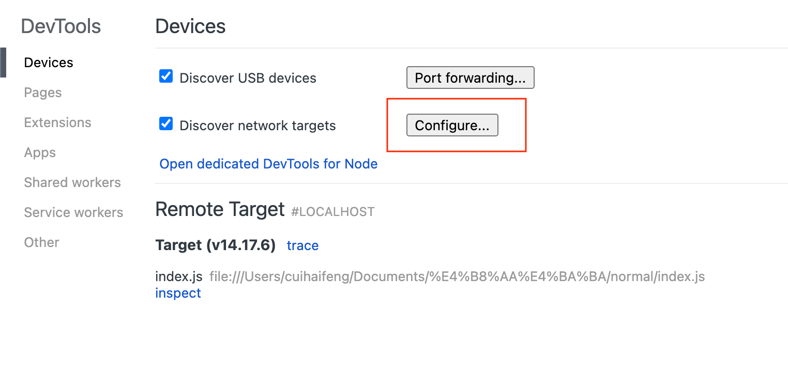

## 调试原理

`debugger` 的含义就是要在某个地方单步运行、查看环境中的变量。那么怎么设置断点、怎么把当前上下文的变量暴露出去呢，就是通过`websoket`建立通信：



通过`v8 debug protocol`也就是`v8`制定的标准调试协议，`client`发送这种标准的数据，让`server`也就是`v8`内核知道怎么执行代码：

```json title="在100行设置断点的数据格式"
{
  "seq":118,
  "type":"request",
  "command":"setbreakpoint",
  "arguments":{
    "type":"script",
    "target":"test.js",
    "line":100
  }
}
```

```json title="查看当前作用域变量的数据格式"
{
  "seq":117,
  "type":"request",
  "command":"scope"
}
```

## 调试工具

> 从调试原理得知无论哪一种调试工具都是要建立`socket`连接通信的，不同的调试工具无非就是`client`不同而已

### start debugger server

因为无论何种调试工具，`debugger server`始终是`v8 引擎`，启动`v8 debugger server`有两种方式：

- `--inspect`： 需要手动打断点，要不然进程不会停留

  ```shell
  node --inspect index.js
  ```

- `--inspect-brk`：会自动在首行断点

  ```shell
  node --inspect-brk server.js
  ```

### chrome devtools

在 `chrome` 地址栏输入 `chrome://inspect`，可以看到有能`attach`的`socket`，如果没有可以点击 `configure` 来配置目标端口：

，[调试typescript](https://code.visualstudio.com/docs/typescript/typescript-debugging)

### vscode

> [vscode debugger配置属性](https://code.visualstudio.com/docs/nodejs/nodejs-debugging#_launch-configuration-attributes)

在 `vscode` 里面写代码，在 `chrome devtools` 里调试比较麻烦，`vscode` 也实现了 `debugger` 的支持，可以直接用 `vscode` 来调试。`vscode`调试有两种方式：

1. `attach`：关联到已启动的`debugger server`上面

  ```json
  {
    "configurations": [
      {
        "name": "attach Node.js",
        "type": "pwa-node",
        // highlight-start
        "request": "attach",
        "port": 9229
        // highlight-end
      }
    ]
  }
  ```

2. `launch`：会自动先启动`debugger server` 然后`attach`上去：

  ```json
  {
    "configurations": [
      {
        "name": "Launch Program",
        "program": "${workspaceFolder}/index.js",
        "request": "launch",
        "stopOnEntry": true,
        "type": "node"
      }
    ]
  }
  ```
