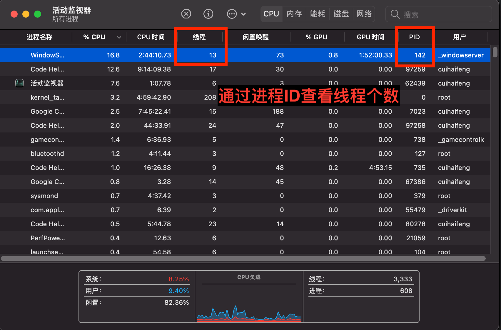
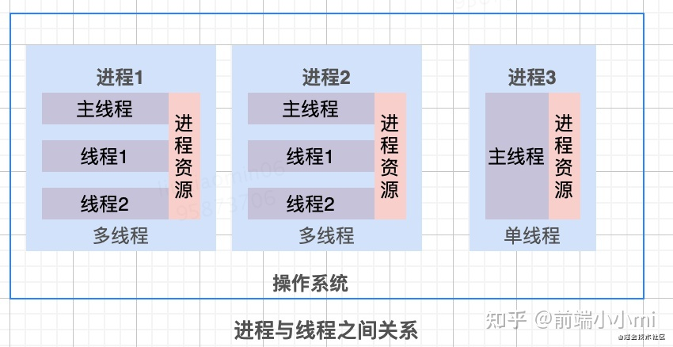
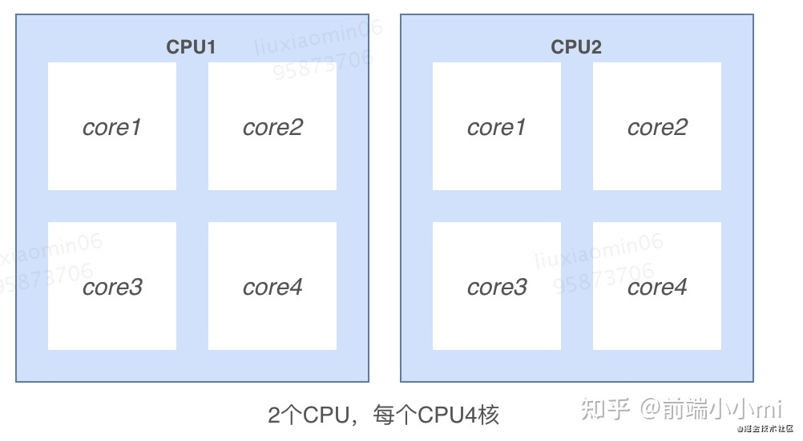
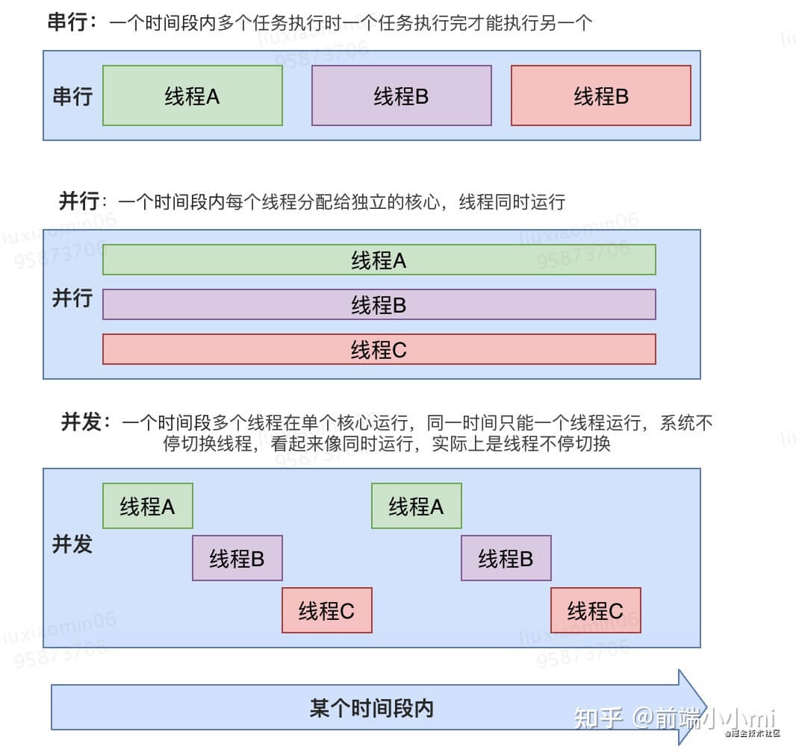

## 进程

> 抽象理解：进程是资源分配的最小单位，线程是 CPU 调度的最小单位。

进程可以说是一个`“执行中的程序”`:

- `程序` 是指令、数据及其组织形式的描述，是一个没有生命的实体。
- 只有`处理器`赋予程序生命时也就是操作系统执行程序，才能成为一个有活动的实体。

:::danger
所有运行起来的程序就是一个进程
:::

### 查看应用的进程ID

```javascript title="Node.js"
console.log(process.pid)
```

### 查看进程启动的线程个数



## 线程

> 是进程的一个实体，是 `cpu` 调度和分派的基本单位，它是比进程更小的能独立运行的基本单位，有时被称为轻量级进程。

我们就可以在一个进程中创建多个线程，让它们在`“同一时刻”`分别去做不同的工作了。这些线程共享同一块内存，线程之间可以共享对象、资源，如果有冲突或需要协同，还可以随时沟通以解决冲突或保持同步。


## 进程和线程的关系

> 进程是包含线程的



> 做个简单的比喻：进程=火车，线程=车厢

1. 一个线程只能属于一个进程，而一个进程可以有多个线程，但至少有一个线程。线程依赖于进程而存在

:::info 释义

- 线程必须从属于某个进程。（单纯的车厢无法运行）
- 一个进程可以包含多个线程。(一列火车可以有多节车厢)

:::

2. 进程之间数据很难共享，线程之间数据容易共享

:::info 释义

- 进程之间数据难以共享。（一列火车上的乘客很难换乘到另一列火车）
- 线程之间的数据容易共享。（同一列车乘客很容易换乘不同的车厢）

:::

3. 进程要比线程消耗更多的计算机资源

:::info 释义
采用多列火车相比多个车厢更耗资源
:::

4. 进程间不会相互影响，一个线程挂掉将导致整个进程挂掉

:::info 释义

- 一列火车不会影响到另外一列火车
- 一列火车上中间的一节车厢着火了，将影响到所有车厢

:::

5. 进程使用的内存地址可以上锁，即一个线程使用某些共享内存时，其他线程必须等它结束，才能使用这一块内存。

:::info 释义
（比如火车上的洗手间）－"互斥锁"
:::

6. 进程使用的内存地址可以限定使用量

:::info 释义
（比如火车上的餐厅，最多只允许多少人进入，如果满了需要在门口等，等有人出来了才能进去）－“信号量”
:::

:::danger

- 多线程技术不是万金油，它有一个致命的缺点：在一个进程内，不管你创建了多少线程，它们总是被限定在一颗 CPU 内，或者多核 CPU 的一个核内。这意味着，多线程在宏观上是并行的，在微观上则是分时切换串行的，多线程编程无法充分发挥多核计算资源的优势。这也是使用多线程做任务并行处理时，线程数量超过一定数值后，线程越多速度反倒越慢的原因。

- 多进程技术正好弥补了多线程编程的不足，我们可以在每一颗 CPU 上，或者多核 CPU 的每一个核上启动一个进程，如果有必要，还可以在每个进程内再创建适量的线程，最大限度地使用计算资源解决问题。因为不在同一块内存区域内，和线程相比，进程间的资源共享、通信、同步等，都要麻烦得多，受到的限制也更多。

:::

## cpu、多核、线程

- 多CPU： 是指简单的多个CPU工作在同一个系统上，多个CPU之间的通讯是通过主板上的总线进行的

- 多核 ：是指一个CPU有多个核心处理器，处理器之间通过CPU内部总线进行通讯



:::danger
一个核心可以处理一个线程，`n`个cpu`m`个核心，可以`并行`处理`n*m`个线程。
:::

## 串行、并发、并行

并发和并行是即相似又有区别的两个概念，并行是指两个或者多个事件在同一时刻发生；而并发是指两个或多个事件在同一时间间隔内发生。在多道程序环境下，并发性是指在一段时间内宏观上有多个程序在同时运行，但在单处理机系统中，每一时刻却仅能有一道程序执行，故微观上这些程序只能是分时地交替执行。倘若在计算机系统中有多个处理机，则这些可以并发执行的程序便可被分配到多个处理机上，实现并行执行，即利用每个处理机来处理一个可并发执行的程序，这样，多个程序便可以同时执行。



- 单CPU中进程只能是并发，多CPU计算机中进程可以并行。
- 单CPU单核中线程只能并发，单CPU多核中线程可以并行。

## 参考

- [“线程和进程的区别是什么？”](https://www.zhihu.com/question/25532384)
- [全面掌握「进程与线程、并发并行与串行、同步与异步、阻塞与非阻塞」的区别](https://zhuanlan.zhihu.com/p/362059793)
- [多核CPU 是否能同时执行多个进程？](https://www.zhihu.com/question/271821176)
