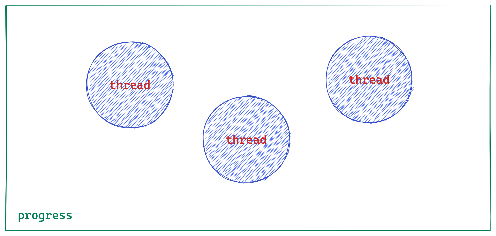

import Fork from './multiple-progress/\_partial-fork.md'

## 进程和线程的区别

> [“线程和进程的区别是什么？”](https://www.zhihu.com/question/25532384)

### 进程

> 抽象理解：进程是资源分配的最小单位，线程是 CPU 调度的最小单位。

进程可以说是一个`“执行中的程序”`:

- `程序` 是指令、数据及其组织形式的描述，是一个没有生命的实体。
- 只有`处理器`赋予程序生命时也就是操作系统执行程序，才能成为一个有活动的实体。

:::danger
所有运行起来的程序就是一个进程
:::

### 线程

> 是进程的一个实体，是 `cpu` 调度和分派的基本单位，它是比进程更小的能独立运行的基本单位，有时被称为轻量级进程。

我们就可以在一个进程中创建多个线程，让它们在`“同一时刻”`分别去做不同的工作了。这些线程共享同一块内存，线程之间可以共享对象、资源，如果有冲突或需要协同，还可以随时沟通以解决冲突或保持同步。



### 区别

> 做个简单的比喻：进程=火车，线程=车厢

1. 一个线程只能属于一个进程，而一个进程可以有多个线程，但至少有一个线程。线程依赖于进程而存在

:::info 释义

- 线程必须从属于某个进程。（单纯的车厢无法运行）
- 一个进程可以包含多个线程。(一列火车可以有多节车厢)

:::

2. 进程之间数据很难共享，线程之间数据容易共享

:::info 释义

- 进程之间数据难以共享。（一列火车上的乘客很难换乘到另一列火车）
- 线程之间的数据容易共享。（同一列车乘客很容易换乘不同的车厢）

:::

3. 进程要比线程消耗更多的计算机资源

:::info 释义
采用多列火车相比多个车厢更耗资源
:::

4. 进程间不会相互影响，一个线程挂掉将导致整个进程挂掉

:::info 释义

- 一列火车不会影响到另外一列火车
- 一列火车上中间的一节车厢着火了，将影响到所有车厢

:::

5. 进程使用的内存地址可以上锁，即一个线程使用某些共享内存时，其他线程必须等它结束，才能使用这一块内存。

:::info 释义
（比如火车上的洗手间）－"互斥锁"
:::

6. 进程使用的内存地址可以限定使用量

:::info 释义
（比如火车上的餐厅，最多只允许多少人进入，如果满了需要在门口等，等有人出来了才能进去）－“信号量”
:::

:::danger

- 多线程技术不是万金油，它有一个致命的缺点：在一个进程内，不管你创建了多少线程，它们总是被限定在一颗 CPU 内，或者多核 CPU 的一个核内。这意味着，多线程在宏观上是并行的，在微观上则是分时切换串行的，多线程编程无法充分发挥多核计算资源的优势。这也是使用多线程做任务并行处理时，线程数量超过一定数值后，线程越多速度反倒越慢的原因。

- 多进程技术正好弥补了多线程编程的不足，我们可以在每一颗 CPU 上，或者多核 CPU 的每一个核上启动一个进程，如果有必要，还可以在每个进程内再创建适量的线程，最大限度地使用计算资源解决问题。因为不在同一块内存区域内，和线程相比，进程间的资源共享、通信、同步等，都要麻烦得多，受到的限制也更多。

:::

## 开启多进程的方式

> `Node.js` 内部通过两个库创建子进程：`child_process` 和 `cluster`

## child_process

`child_process` 模块提供了四个创建子进程的函数：`spawn` 、`execFile` 、`exec` 、`fork`

### fork

<Fork />

## 进程之间通信方式

> 试想有以下两个独立的进程，它们通过执行两个 `js` 文件创建，那么如何在它们之间传递信息呢？

### 信号

> 信号是一种通信机制，程序运行时会接受并处理一系列信号，并且可以发送信号。

#### 发送信号

可以通过 `kill` 指令向指定进程发送信号，如下例子表示向 `pid` 为 `3000` 的进程发送 `USR2` 信号（用户自定义信号）

```shell
// shell指令，可以直接在命令行中输入
$ kill -USR2 3000
```

#### 接收信号

定义 `process` 在指定信号事件时，执行处理函数即可接收并处理信号。

```javascript
process.on('SIGUSR2', () => {
  console.log("接收到了信号USR2");
}
```

:::danger
在收到未定义处理函数的信号时进程会直接退出
:::

完整列子：

```javascript title="接收信号"
console.log('PID', process.pid) // 58666

setInterval(() => {
  console.log('PROCESS 1 is alive')
}, 5000)

process.on('SIGUSR2', () => {
  console.log('收到了USR2信号')
})
```

```javascript title="发送信号"
const ChildProcess = require('child_process')

console.log('PID', process.pid)

setInterval(() => {
  console.log('PROCESS 2 is alive')
}, 5000)

ChildProcess.exec('kill -USR2 58666')
```

### 套接字(socket)

> 通过在接受方和发送方之间建立 socket 连接实现全双工通信，例如在两者间建立 TCP 连接：

```javascript
// Server
const net = require('net')

let server = net.createServer(client => {
  client.on('data', msg => {
    console.log('ONCE', String(msg))
    client.write('server send message')
  })
})
server.listen(8087)

// Client
const net = require('net')
const client = new net.Socket()
client.connect('8087', '127.0.0.1')
client.on('data', data => console.log(String(data)))
client.write('client send message')
```

### 命名管道

> 命名管道可以在不相关的进程之间和不同的计算机之间使用，建立命名管道时给他指定一个名字，任何进程都可以使用名字将其打开，根据给定权限进行通信。

```shell title="第一步：创建命名管道/tmp/nfifo"
mkfifo /tmp/nfifo
```

```javascript title="读写文件"
// Server
const fs = require('fs')
fs.writeFile('/tmp/tmpipe', 'info to send', (data, err) => console.log(data, err))

// Client
const fs = require('fs')
fs.readFile('/tmp/tmpipe', (err, data) => {
  console.log(err, String(data))
})
```

:::danger
与读取一般的文件不同，读取一般的文件会直接返回结果，而读取 fifo 则会等待，在 fifo 有数据写入时返回结果，然后开启 server，server 向 fifo 中写入信息，client 将收到信息
:::

### 原生通信方式：父子进程之间

> `Node.js` 创建进程时便实现了其进程间通信，但这种方式只能够用于父子进程之间的通信

原生的 `Node.js` 在 `windows` 中使用命名管道实现，在 `* nix` 系统采用 `unix domain socket（套接字）`实现，它们都可以实现全双工通信，`Node.js` 对这些底层实现进行了封装，表现在应用层上的进程间通信，只有简单的 `message` 事件和 `send ()` 方法，例如父子进程发送消息：

```javascript
// 主进程 process.js
const fork = require('child_process').fork
const worker = fork('./child_process.js')
worker.send('start')
worker.on('message', msg => {
  console.log(`SERVER RECEIVED: ${msg}`)
})

// 子进程 child_process.js
process.on('message', msg => {
  console.log('CLIENT RECEIVED', msg)
  process.send('done')
})
```

### 通信方式：兄弟进程之间

Node.js 创建进程时便实现了其进程间通信，但这种方式只能够用于父子进程之间的通信，而不能在兄弟进程之间通信，若要利用原生的方式实现兄弟进程之间的通信，则需要借助它们公共的父进程，发送消息的子进程将消息发送给父进程，然后父进程收到消息时将消息转发给接收消息的进程。但是使用这种方式进行进程间的通信经过父进程的转发效率低下，所以我们可以根据 Node.js 原生的进程间通信方式实现兄弟进程的通信：在 windows 上使用命名管道，在 \* nix 上使用 unix 域套接字，该方法与上文套接字通信类似，只是这里不是监听一个端口，而是使用一个文件。

```javascript
// Server
const net = require('net')
let server = net.createServer(() => {
  console.log('Server start')
})
server.on('connection', client => {
  client.on('data', msg => {
    console.log(String(msg))
    client.write('server send message')
  })
})
server.listen('/tmp/unix.sock')

// Client
const net = require('net')
const client = new net.Socket()
client.connect('/tmp/unix.sock')
client.on('data', data => console.log(String(data)))
client.write('client send message')
```

启动 server 后会在指定路径创建文件，用于 ipc 通信。

## 参考

- [Node.js 多进程/线程 —— 日志系统架构优化实践](https://mp.weixin.qq.com/s/s3DeAxrEbVmqtCHGP9lstg)
- [线程和进程的区别是什么？](https://www.zhihu.com/question/25532384)
