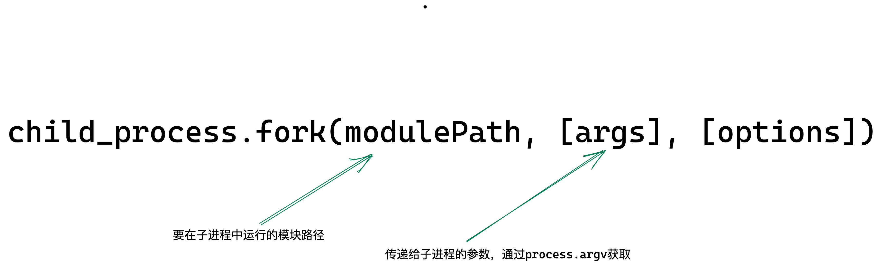

> `fork`用户开启`NodeJS`应用，也就是执行`NodeJS`脚本文件，衍生的 `Node.js` 子进程独立于父进程， 每个进程都有自己的内存，具有自己的 `V8` 实例。 由于需要额外的资源分配，不建议衍生大量子 `Node.js` 进程。



`demo`如下：

```javascript
// main.js
const { fork } = require('child_process')
const child_process_fork = fork('./child.js', ['development', '9999'], { env: { Debug: true } })

// child.js
const args = process.argv[3] // 9999
const env = process.env.Debug // true
```

#### options

> [完整 options 列表](http://nodejs.cn/api/child_process.html#child_processforkmodulepath-args-options)
