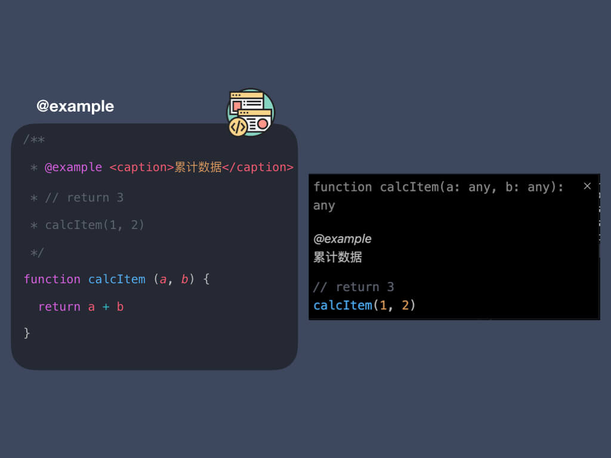

### 设置 example 标题

```javascript
/**
 * @example <caption>设置标题<caption>
 */
```

### 设置 example 代码注释

```javascript {3}
/**
 * @example <caption>设置标题<caption>
 * // 注释
 */
```

### 设置 example 代码

```javascript {3}
/**
 * @example <caption>设置标题<caption>
 * code
 */
```

:::success
只要不带`//`就是`example code`
:::


