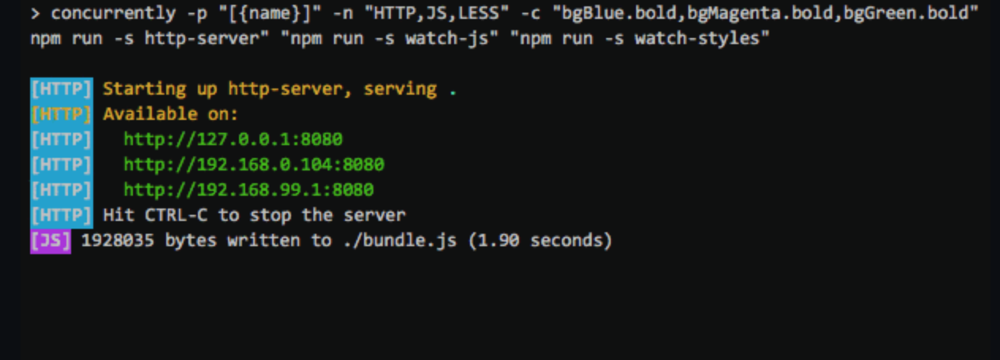

## run scripts

### concurrently

> [concurrently](https://github.com/open-cli-tools/concurrently)友好的并行执行命令

```shell
concurrently "npm:watch-js" "npm:watch-css" "npm:watch-node"

# Equivalent to:
concurrently -n watch-js,watch-css,watch-node "npm run watch-js" "npm run watch-css" "npm run watch-node"
```


