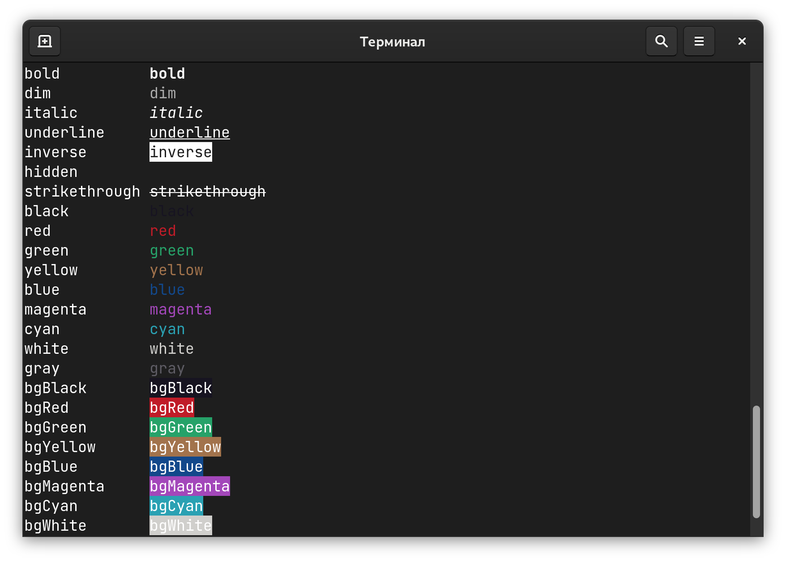

## 颜色

### nanocolors 字体颜色

> [nanocolors](https://github.com/ai/nanocolors)，没有任何依赖，包体积也比较小，号称比 chalk 快几倍，能够在浏览器中使用

```jsx
import { green, bold } from 'nanocolors'

console.log(
  green(`Task ${bold('1')} was finished`)
)
```



### gradient-string 字体渐变色

> [gradient-string](https://github.com/bokub/gradient-string) 文字渐变色

```jsx
const gradient = require('gradient-string');

console.log(gradient('cyan', 'pink')('Hello world!'));
```


