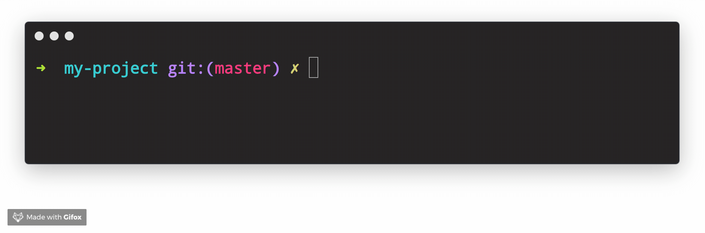

## 用户提示

### enquirer 美观的终端对话

> [enquirer](https://github.com/enquirer/enquirer) 时尚，美观的终端用户提示

```jsx
const { prompt } = require('enquirer');

const response = await prompt({
  type: 'input',
  name: 'username',
  message: 'What is your username?'
});
```

