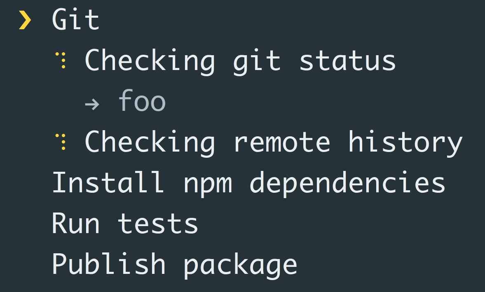

## loading

### tasuku 任务运行期

> [tasuku](https://github.com/privatenumber/tasuku) 终端最小的任务运行器，用来编排任务，显示任务 `loading`，`pedding`，`finish`，`error` 状态

```jsx
import task from 'tasuku'

task('Task 1', async () => {
    await someAsyncTask()
})

task('Task 2', async () => {
    await someAsyncTask()
})

task('Task 3', async () => {
    await someAsyncTask()
})
```


### ora 渲染Loading

> [ora](https://github.com/sindresorhus/ora) 优雅的终端 `loading` 渲染器

```jsx
import ora from 'ora';

const spinner = ora('Loading unicorns').start();

setTimeout(() => {
	spinner.color = 'yellow';
	spinner.text = 'Loading rainbows';
}, 1000);
```


### listr 任务运行期

> [listr](https://github.com/samverschueren/listr) 同样是用来终端编排任务，和 [tasuku](https://www.notion.so/node-9b222177719b4c02adfb6e3bacbd156d) 主要区别在于：需要提前编排好任务

```jsx
const tasks = new Listr([
  {
    title: 'Success',
    task: () => 'Foo'
  },
  {
    title: 'Failure',
    task: () => {
      throw new Error('Bar')
    }
  }
]);
```


