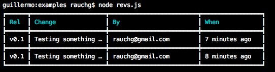

## table

### cli-table3

> [cli-table3](https://github.com/cli-table/cli-table3) 终端显示表格

```jsx
var Table = require('cli-table3');

// instantiate
var table = new Table({
    head: ['TH 1 label', 'TH 2 label']
  , colWidths: [100, 200]
});

// table is an Array, so you can `push`, `unshift`, `splice` and friends
table.push(
    ['First value', 'Second value']
  , ['First value', 'Second value']
);

console.log(table.toString());
```

