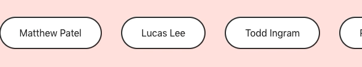

## 拖拽库

### [1. ](https://github.com/react-dnd/react-dnd)

功能强大而且支持`ts`以及`hook`的拖拽库

```jsx
import React from 'react'
import { useDrag } from 'react-dnd'
import { ItemTypes } from './Constants'

export default function Card({ isDragging, text }) {
  const [{ opacity }, dragRef] = useDrag({
    item: { type: ItemTypes.CARD, text },
    collect: (monitor) => ({
      opacity: monitor.isDragging() ? 0.5 : 1
    })
  })
  return (
    <div ref={dragRef} style={{ opacity }}>
      {text}
    </div>
  )
}
```

### [2. ](https://github.com/nickmcmillan/react-physics-dragger)

水平带有弹性的拖拽库

```jsx
import Dragger from 'react-physics-dragger'
import ResizeObserver from 'resize-observer-polyfill' // this one works pretty great

const App = () => {
  return (
    <Dragger
      ResizeObserverPolyfill={ResizeObserver} // remember; only if you need it, else it uses window.ResizeObserver
    >
        <div>1</div>
        <div>2</div>
        <div>3</div>
    </Dragger>
  )
}
```


## 轮播图

### [1. ](https://github.com/davidcetinkaya/embla-carousel)

轻量级的而且可以使用 `hook` 方式的轮播图组件

```tsx
import React from 'react'
import { useEmblaCarousel } from 'embla-carousel/react'

export const EmblaCarousel = () => {
  const [emblaRef] = useEmblaCarousel()

  return (
    <div className="embla" ref={emblaRef}>
      <div className="embla__container">
        <div className="embla__slide">Slide 1</div>
        <div className="embla__slide">Slide 2</div>
        <div className="embla__slide">Slide 3</div>
      </div>
    </div>
  )
}
```
