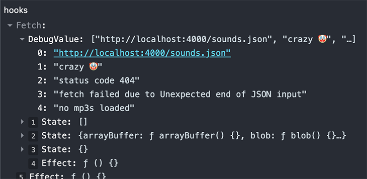

## useDebugValue

> 在 React 开发者工具中显示自定义 hook 的标签，主要用来调试使用

```javascript
function useFriendStatus(friendID) {
  const [isOnline, setIsOnline] = useState(null)
  // 在开发者工具中的这个 Hook 旁边显示标签
  // e.g. "FriendStatus: Online"
  useDebugValue(isOnline ? 'Online' : 'Offline')
  return isOnline
}
```



:::danger

- 在开发共享库的时候，这个 hook 就有很大的价值
- 延迟格式化 debug 值：useDebugValue 接受一个格式化函数作为可选的第二个参数。该函数只有在 Hook 被检查时才会被调用。它接受 debug 值作为参数，并且会返回一个格式化的显示值。

```javascript
useDebugValue(date, date => formatData(date))
```

:::
