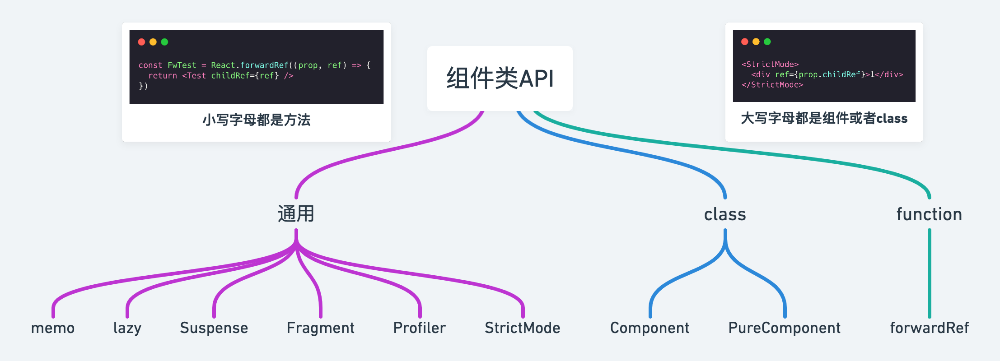
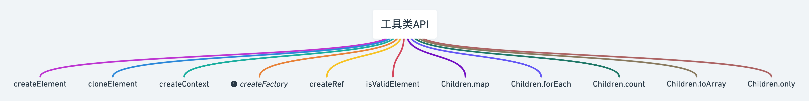
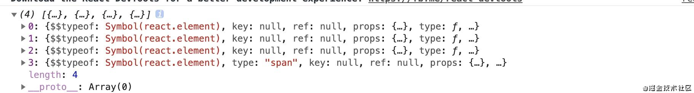

## 组件类



### 1. Component

用 `class` 申明组件的基类

```jsx
class Greeting extends React.Component {
  render() {
    return <h1>Hello, {this.props.name}</h1>;
  }
}
```

### 2. PureComponent

`[pjʊr]：adj. (pure) 纯的；纯粹的；纯洁的；`

`PureComponent` 和 `Component` 用法，差不多一样，

```jsx {13}
class Index extends React.PureComponent{
  constructor(props){
      super(props)
      this.state={
          data:{
            name:'alien',
            age:28
          }
      }
  }
  handerClick= () =>{
      const { data } = this.state
      data.age++
      this.setState({ data })
  }
  render(){
      const { data } = this.state
      return <div className="box" >
      <div className="show" >
          <div> 年龄： { data.age  }</div>
          <button onClick={ this.handerClick } >age++</button>
      </div>
  </div>
  }
}
```

:::warning 点击按钮没有反应

- 纯组件 `PureComponent` 会浅比较，`props 和 `state` 是否相同，来决定是否重新渲染组件。所以一般用于性能调优，减少 `render` 次数。

- 浅比较，因为 `data state` 是个对象，引用没有发生变化，所以浅比较是没有变化的，不会触发渲染。

- 如何解决

  ```jsx
  this.setState({ data:{...data} })
  ```

:::

### 3. memo

和 `PureComponent` 类似，但是 `React.memo`，`“只会对 props进行浅比较”`，组件内部的 `state, context` 变化，仍然会触发 `render`。

```jsx
const MyComponent = React.memo(function MyComponent(props) {
  /* 使用 props 渲染 */
});
```

:::success
- 默认通过[浅比较](/react/goods/reactShallowCompare) 判断是否进行渲染，也可以自定义判断

  ```js
  function MyComponent(props) {
    /* 使用 props 渲染 */
  }
  function areEqual(prevProps, nextProps) {
    /*
    如果把 nextProps 传入 render 方法的返回结果与
    将 prevProps 传入 render 方法的返回结果一致则返回 true，
    否则返回 false
    */
  }
  export default React.memo(MyComponent, areEqual);
  ```

:::

### 4. forwardRef

转发`ref`, 比如父组件想获取孙组件，某一个dom元素。这种隔代ref获取引用，就需要forwardRef来助力。

```tsx
const Parent = React.forwardRef<HTMLDivElement>((prop, ref) => <p ref={ref}>1</p>)

function Combine() {
  const item = React.useRef(null)

  React.useEffect(() => {
    console.log()
  })
  return (
    <div>
      <Parent ref={item} />
    </div>
  )
}
```

:::success

- 也就是当子组件挂载的时候，会调用传递过去的 `ref`
- react不允许ref通过props传递，因为组件上已经有 ref 这个属性,在组件调和过程中，已经被特殊处理，forwardRef出现就是解决这个问题，把ref转发到自定义的forwardRef定义的属性上，让ref，可以通过props传递。
:::

### 5. lazy

React.lazy 接受一个函数，这个函数需要动态调用 import()。它必须返回一个 Promise ，该 Promise 需要 resolve 一个 default export 的 React 组件。

```jsx
import Test from './comTest'
const LazyComponent =  React.lazy(()=> new Promise((resolve)=>{
      setTimeout(()=>{
          resolve({
              default: ()=> <Test />
          })
      },2000)
}))
class index extends React.Component{
    render(){
        return <div className="context_box"  style={ { marginTop :'50px' } }   >
           <React.Suspense fallback={ <div className="icon" ><SyncOutlined  spin  /></div> } >
               <LazyComponent />
           </React.Suspense>
        </div>
    }
}
```

### 6. Suspense

配合 `lazy` 实现异步渲染组件目的。

```jsx
const ProfilePage = React.lazy(() => import('./ProfilePage')); // 懒加载
<Suspense fallback={<Spinner />}>
  <ProfilePage />
</Suspense>
```

### 7. Fragment

同 `<></>` 一样提供包裹组件功能

```jsx
<Fragment>
   <span></span>
   <span></span>
   <span></span>
</Fragment>
```

:::warning
和 `Fragment` 区别是，`Fragment` 可以支持 `key` 属性。`<></>` 不支持 `key` 属性。
:::

### 8. Profiler

Profiler这个api一般用于开发阶段，性能检测，检测一次react组件渲染用时，性能开销。

```jsx
const index = () => {
  const callback = (...arg) => console.log(arg)
  return <div >
    <div >
      <Profiler id="root" onRender={ callback }  >
        <Router  >
          <Meuns/>
          <KeepaliveRouterSwitch withoutRoute >
              { renderRoutes(menusList) }
          </KeepaliveRouterSwitch>
        </Router>
      </Profiler>
    </div>
  </div>
}
```

### 9. StrictMode

StrictMode见名知意，严格模式，用于检测react项目中的潜在的问题，。与 Fragment 一样， StrictMode 不会渲染任何可见的 UI 。它为其后代元素触发额外的检查和警告。

```jsx
<React.StrictMode>
  <Router  >
      <Meuns/>
      <KeepaliveRouterSwitch withoutRoute >
          { renderRoutes(menusList) }
      </KeepaliveRouterSwitch>
  </Router>
</React.StrictMode>
```

## 工具类



### 1. createElement

一提到createElement，就不由得和JSX联系一起。我们写的jsx，最终会被 babel，用createElement编译成react元素形式。我写一个组件，我们看一下会被编译成什么样子

如果我们在render里面这么写：

```jsx
render(){
  return <div className="box" >
      <div className="item"  >生命周期</div>
      <Text  mes="hello,world"  />
      <React.Fragment> Flagment </React.Fragment>
      { /*  */ }
      text文本
  </div>
}
```

会被编译成这样：

```jsx
render() {
  return React.createElement("div", { className: "box" },
          React.createElement("div", { className: "item" }, "\u751F\u547D\u5468\u671F"),
          React.createElement(Text, { mes: "hello,world" }),
          React.createElement(React.Fragment, null, " Flagment "),
          "text\u6587\u672C");
  }

```

### 2. cloneElement

cloneElement的作用是以 element 元素为样板克隆并返回新的 React 元素。返回元素的 props 是将新的 props 与原始元素的 props `浅层合并`后的结果。

我们设置一个场景，在组件中，去劫持children，然后给children赋能一些额外的props:

```jsx
function FatherComponent({ children }){
    const newChildren = React.cloneElement(children, { age: 18})
    return <div> { newChildren } </div>
}

function SonComponent(props){
    console.log(props)
    return <div>hello,world</div>
}

class Index extends React.Component{
    render(){
        return <div className="box" >
            <FatherComponent>
                <SonComponent name="alien"  />
            </FatherComponent>
        </div>
    }
}
```

### 3. createContext

createContext用于创建一个Context对象，createContext对象中，包括用于传递 Context 对象值 value的Provider，和接受value变化订阅的Consumer。

```jsx
const MyContext = React.createContext(defaultValue)

function ComponentB(){
    /* 用 Consumer 订阅， 来自 Provider 中 value 的改变  */
    return <MyContext.Consumer>
        { (value) => <ComponentA  {...value} /> }
    </MyContext.Consumer>
}

function ComponentA(props){
    const { name , mes } = props
    return <div> 
            <div> 姓名： { name }  </div>
            <div> 想对大家说： { mes }  </div>
         </div>
}

function index(){
    const [ value , ] = React.useState({
        name:'alien',
        mes:'let us learn React '
    })
    return <div style={{ marginTop:'50px' }} >
        <MyContext.Provider value={value}  >
          <ComponentB />
    </MyContext.Provider>
    </div>
}
```

### 4. createFactory 已废弃

已废弃

### 5. createRef

createRef可以创建一个 ref 元素，附加在react元素上。

```jsx
class Index extends React.Component{
  constructor(props){
      super(props)
      this.node = React.createRef()
  }
  componentDidMount(){
      console.log(this.node)
  }
  render(){
      return <div ref={this.node} > my name is alien </div>
  }
}
```

:::warning

- `ref` 的绑定实际上就是元素挂载的时候，调用方法赋值。

  ```jsx {8}
  class Index extends React.Component{
    node = null
    componentDidMount(){
        console.log(this.node)
    }
    render(){
        return <div ref={(node)=> this.node } > my name is alien </div>
    }
  }
  ```

- 在 `function` 组件中可以通过 `useRef` 来解决

  ```jsx {2,6}
  function Index(){
      const node = React.useRef(null)
      useEffect(()=>{
          console.log(node.current)
      },[])
      return <div ref={node} >  my name is alien </div>
  }
  ```

:::

### 6. isValidElement

验证是否是 `react` 元素。

### 7. Children.map

`React.Children` 提供了用于处理 `this.props.children` `不透明数据结构`的实用方法。

有的同学会问遍历 children用数组方法,map ，forEach 不就可以了吗？ 请我们注意一下不透明数据结构,什么叫做不透明结构?

- `透明的数据结构`

```jsx {3-8}
function Index(){
  return <div style={{ marginTop:'50px' }} >
      <WarpComponent>
          <Text/>
          <Text/>
          <Text/>
          <span>hello,world</span>
      </WarpComponent>
  </div>
}
```

打印结果：



- `不透明数据结构`

但是我们把Index结构改变一下：

```jsx
function Index(){
  return <div style={{ marginTop:'50px' }} >
      <WarpComponent>
          { new Array(3).fill(0).map(()=><Text/>) }
          <span>hello,world</span>
      </WarpComponent>
  </div>
}
```

打印结果：


- 这个时候就需要 `React.Children` 来处理：

```jsx
function WarpComponent(props){
    const newChildren = React.Children.map(props.children,(item)=>item)
    console.log(newChildren)
    return newChildren
}
```

### 8. Children.forEach

```jsx
function WarpComponent(props){
    React.Children.forEach(props.children,(item)=>console.log(item))
    return props.children
}
```

### 9. Children.count

统计子元素的数量

### 10. Children.toArray

Children.toArray返回，props.children扁平化后结果。

### 11. Children.only

验证 children 是否只有一个子节点（一个 React 元素），如果有则返回它，否则此方法会抛出错误。

## Hooks

### 1. useState

```tsx
function Combine() {
  const [count, setCount] = React.useState<number>(1)

  function clickEvent() {
    setCount(ct => ct + 1)
  }
  return (
    <>
      <div>{count}</div>
      <button onClick={clickEvent} type="button">点击</button>
    </>
  )
}
```

### 2. useEffect

```tsx
function Combine() {
  React.useEffect(() => {
    document.title = '商品'
  })

  return (<div>商品</div>)
}
```

### 3. useMemo

useMemo接受两个参数，第一个参数是一个函数，返回值用于产生保存值。 第二个参数是一个数组，作为dep依赖项，数组里面的依赖项发生变化，重新执行第一个函数，产生新的值。

```tsx
function Combine() {
  const count = React.useMemo<number>(() => 1, [])

  return (
    <div>
      商品
      {count}
    </div>
  )
}
```

### 4. useCallback

于 useMemo 返回的是函数运行的结果， useCallback 返回的是 `函数`。 返回的callback可以作为props回调函数传递给子组件。

```tsx
function Combine() {
  const getCount = React.useCallback<() => number>(() => 1, [])

  return (
    <div>
      商品
      {getCount()}
    </div>
  )
}
```

### 5. useRef

useRef的作用：

- 一 是可以用来获取dom元素，或者class组件实例 。

- 二 创建useRef时候，会创建一个原始对象，只要函数组件不被销毁，原始对象就会一直存在，那么我们可以利用这个特性，来通过useRef保存一些数据。也就是会创建一个 `可变的数据对象`

```tsx
function Combine() {
  const inputRef = React.useRef<HTMLInputElement>(null)

  return (
    <div>
      <input ref={inputRef} type="text" name="" id="" />
    </div>
  )
}
```

### 6. useLayoutEffect

- useEffect执行顺序: 组件更新挂载完成 -> 浏览器 dom 绘制完成 -> 执行 useEffect 回调。

- useLayoutEffect 执行顺序: 组件更新挂载完成 ->  执行 useLayoutEffect 回调-> 浏览器dom绘制完成。

所以说 useLayoutEffect 代码可能会阻塞浏览器的绘制 。

```tsx
function Combine() {
  const inputRef = React.useRef<HTMLInputElement>(null)

  React.useLayoutEffect(() => {
    console.log(inputRef.current)
  })
  return (
    <div>
      <input ref={inputRef} type="text" name="" id="" />
    </div>
  )
}
```

### 7. useReducer

用来解决复杂 `state`，或者多个 `state` 依赖的情况。

```tsx
const person = {
  age: 18,
  height: 180
}

function personReducer(state: typeof person, action: 'add' | 'sub') {
  switch (action) {
    case 'add':
      return {
        age: state.age + 1,
        height: state.height + 1
      }
      break
    default:
      return state
  }
}

function Combine() {
  const [iPerson, dispatchPerson] = React.useReducer(personReducer, person)
}
```

### 8. useContext

`useContext` 可以代替 `context.Consumer` 来获取 `Provider` 中保存的 `value` 值。

- 通过 `context.Consumer` 获取值的示例：

```tsx {6-8,13-15}
const personDefault = { age: 18, height: 180 }
const PersonContext = React.createContext(personDefault)

function Age() {
  return (
    <PersonContext.Consumer>
      { person => (<div>年龄 {person.age}</div>) }
    </PersonContext.Consumer>
  )
}
function Height() {
  return (
    <PersonContext.Consumer>
      { person => (<div>身高{person.height}</div>) }
    </PersonContext.Consumer>
  )
}

function Combine() {
  const [person, setPerson] = React.useState(personDefault)
  return (
    <PersonContext.Provider value={person}>
      <input type="button" onClick={() => setPerson({ age: person.age + 1, height: person.height })} value="设置年龄" />
      <input type="button" onClick={() => setPerson({ age: person.age, height: person.height + 1 })} value="设置身高" />

      <Age />
      <Height />
    </PersonContext.Provider>
  )
}
```

- 直接通过 `useContext` 来获取的示例：

```tsx {5-6,9-10}
const personDefault = { age: 18, height: 180 }
const PersonContext = React.createContext(personDefault)

function Age() {
  const person = React.useContext(PersonContext)
  return <div>年龄{person.age}</div>
}
function Height() {
  const person = React.useContext(PersonContext)
  return <div>身高{person.height}</div>
}

function Combine() {
  const [person, setPerson] = React.useState(personDefault)
  return (
    <PersonContext.Provider value={person}>
      <input type="button" onClick={() => setPerson({ age: person.age + 1, height: person.height })} value="设置年龄" />
      <input type="button" onClick={() => setPerson({ age: person.age, height: person.height + 1 })} value="设置身高" />

      <Age />
      <Height />
    </PersonContext.Provider>
  )
}
```

### 9. useImperativeHandle

`useImperativeHandle` 可以配合 `forwardRef` 自定义暴露给父组件的实例值。

比如：父组件控制子组件输入框自动触发焦点并赋值：

```tsx {5-11,23}
function Child(prop: any, ref: any) {
  const [val, setVal] = React.useState('')
  const inputRef = React.useRef<HTMLInputElement>(null)

  React.useImperativeHandle(ref, () => ({
    focus: () => {
      inputRef.current?.focus()
    },
    setValue: (value: string) => {
      setVal(value)
    }
  }))
  return (
    <input onChange={event => { setVal(event.target.value) }} type="text" name="" id="" value={val} />
  )
}
const CpChild = React.forwardRef(Child)

function Parent() {
  const ref = React.useRef<any>(null)
  return (
    <>
      <CpChild ref={ref} />
      <input type="button" onClick={() => { ref.current?.focus(); ref.current?.setValue(Math.random()) }} value="设置"/>
    </>
  )
}
```

### 10. useDebugValue

useDebugValue 可用于在 React 开发者工具中显示自定义 hook 的标签。这个hooks目的就是检查自定义hooks

```jsx
function useFriendStatus(friendID) {
  const [isOnline, setIsOnline] = useState(null);
  // ...
  // 在开发者工具中的这个 Hook 旁边显示标签
  // e.g. "FriendStatus: Online"
  useDebugValue(isOnline ? 'Online' : 'Offline');

  return isOnline;
}
```
