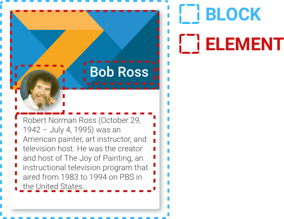

## 1. 组件拆分

### 1.1 无状态组件和容器组件

:::success 组件释义

- 无状态组件：也就是功能性组件，不包含任何状态，尤其是和`redux`结合使用的时候
- 容器组件：也就是用来包裹功能性组件的组件，用来定义状态，并将数据通过`props`传递
:::

:::warning 意义

- 解耦
- 无状态组件，性能会提高，因为这些组件避免了不必要的检查和内存分配
- 测试组件更方便
:::

### 1.2 dot 组件模式

```jsx
<Icons.Notification size="large" />
```

有些组件挺适合这种模式的，看起来比较清晰。实现方式：

```jsx title="函数式组件"
import React from 'react';

const MyComponents = {
  DatePicker: function DatePicker(props) {
    return <div>Imagine a {props.color} datepicker here.</div>;
  }
}

function BlueDatePicker() {
  return <MyComponents.DatePicker color="blue" />;
}
```

```jsx title="class组件"
import React, { Component } from 'react';

export default class Menu extends Component {
  static Item = ({ children }) => <li>{children}</li>;

  render() {
    return (
      <ul>{this.props.children}</ul>
    );
  }
}
```

## 目录结构



### Block

> [参考](https://github.com/yuxino/blog/issues/64)

这个 `Card` 组件是一个 `Block`。 `Card` 不会响应任何业务逻辑。它由这些 `child Elements` :组成 `Header`, `Image`, `Text`, 还有 `Title`。

### Card Block的文件结构

```js

├ src/
├── blocks/
| ├── Card/
| | ├── Header.js
| | ├── Image.js
| | ├── Text.js
| | ├── Title.js
| | └── index.js // <- Block
```

### Card Block Component

```tsx
// src/blocks/Card/index.js
import styled from 'styled-components';

import Header from './Header';
import Image from './Image';
import Text from './Text';
import Title from './Title';

const Card = styled.div`
  background: #ffffff;
  border-radius: 2px;
  margin: 5px 5px 10px;
  padding: 5px;
  position: relative;
  box-shadow: 2px 2px 4px 0px #cfd8dc;
`;

Card.Header = Header;
Card.Image = Image;
Card.Text = Text;
Card.Title = Title;

export default Card;
```

### 使用 Block

```tsx
// SomeComponent.js

import Card from './blocks/Card';

<Card>
  <Card.Header>
    <Card.Image
      alt=”bob-ross-headshot”
      src=”www.example.com/bob-ross.jpg”
    />
    <Card.Title>
      Bob Ross
    </Card.Title>
  </Card.Header>
  <Card.Text>
    Robert Norman Ross (October 29, 1942 – July 4, 1995) was an American painter,
    art instructor, and television host. He was the creator and host of
    The Joy of Painting, an instructional television program that aired from
    1983 to 1994 on PBS in the United States…
  </Card.Text>
</Card>
```

这种写法非常清晰且可读。相较于这种引入方式写法会更加简洁:

```tsx
import Card from './blocks/Card';
import CardHeader from './blocks/Card/Header';
import CardImage from './blocks/Card/Image';
import CardText from './blocks/Card/Text';
import CardTitle from './blocks/Card/Title';
```
