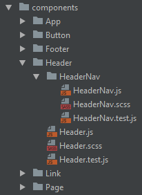

### 1. 文件以及文件夹名称采用 ”大驼峰“ 命名

```
├── Header
│   ├── Header.tsx
```

### 2. 采用完整的命名

比如 `Header` 下的 `Nav`：

```
.
├── Header
│   └── HeaderNav
│       └── HeaderNav.tsx
```

:::warning

- 搜索文件的时候能直接定位。
- 在便捷器的`tab`栏，也能够清晰的辨别文件。

  - 不好的方式：
  
  - 好的方式：
  
:::
