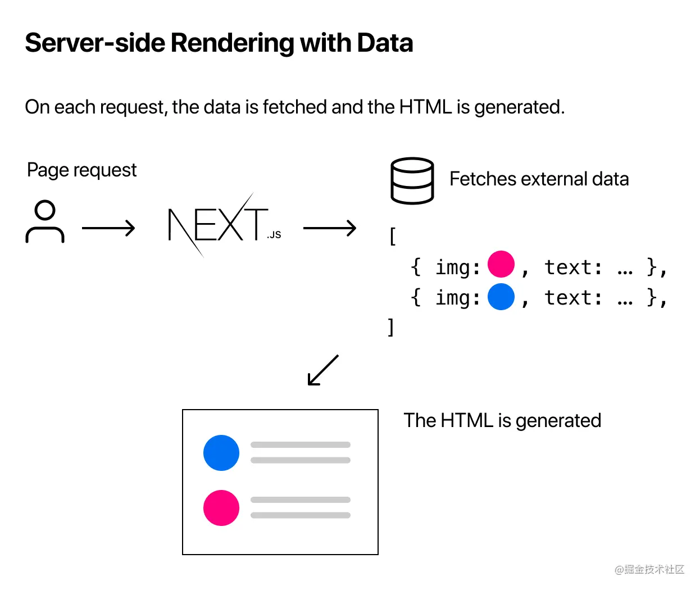

## 客户端渲染（CSR）

普通的单页应用只有一个 HTML，初次请求返回的 HTML 中没有任何页面内容，需要通过网络请求 JS bundle 并渲染，整个渲染过程都在客户端完成，所以叫客户端渲染（CSR）

## 服务端渲染（SSR）

### 运行步骤

1. 用户发送链接请求到 Server
2. Server 请求数据
3. 将请求的数据和组件结合 response 成 html 内容，返回到浏览器



:::danger SSR 问题

1. `对服务器有较高的要求`：消耗的资源与页面的访问量成正相关，当页面的访问量突增时，渲染服务也需要进行扩容；
2. `距离服务端比较远的用户，性能比较差`：服务端只能部署在有限的几个地域，对于距离服务端较远的用户而言，加载速度跟静态资源的 CDN 相比，慢了一个数量级（通常是 1-5ms VS 50-100+ms）
3. `额外的人力维护成本`：需要增加像传统服务端同样的运维、监控告警等方面的工作

:::

### Next.js SSR 开启

1、开启方式：路由页面导出`getServerSideProps`方法

```javascript
export default function FirstPost(props) {
  const {title} = props
  return (
    <Layout>
      <h1>{title}</h1>
    </Layout>
  )
}

// getServerSideProps方法，说明开启SSR渲染模式
export async function getServerSideProps(context) {
  const title = await getTitle(context.req)
  return {
    // 返回组件的props
    // highlight-start
    props: {
      title
    }
    // highlight-end
  }
}
```

2、 [`context`](https://nextjs.org/docs/basic-features/data-fetching#getserversideprops-server-side-rendering)对象常用数据：

- `params`：动态路由`[id].js`的参数: `{id:...}`
- `req`：http request 的数据
- `res`：http response 的数据
- `requery`：包含 params 以及`?`参数部分， 路由定义：`post/[id].js`，访问链接：`post/test?art=1`，最终数据：`{ id: 'test', art: 1 }`

3、`getServerSideProps`可以返回的数据对象：

- `props`
- `notFound`：返回 404 页面

```javascript
export async function getServerSideProps(context) {
  const res = await fetch(`https://...`)
  const data = await res.json()
  if (!data) {
    return {
      // highlight-next-line
      notFound: true
    }
  }
  return {
    props: {}
  }
}
```

- `redirect`：重定向

:::danger 注意事项

- `getServerSideProps`只会在服务端运行，如果是通过单页路由跳转的，那么`next.js`会像服务端发送一个请求，这个请求到了服务端会执行这个`getServerSideProps`，然后将数据返回
- `getServerSideProps`只能从页面级文件中导出
- [`查看SSR代码在客户端运行剔除的代码工具`](https://next-code-elimination.vercel.app/)

:::

## 渲染模式的选择

| **渲染模式** | **适用场景**      | **不适用场景**           | **备注**                                                                                           |
| ------------ | ----------------- | ------------------------ | -------------------------------------------------------------------------------------------------- |
| SSR          | 必须要 SEO 的场景 | 私人的，特定于用户的页面 | 大多数场景使用 SSG，1、预编译好的 html 浏览器端发送数据请求，速度不会太慢，2、减少服务器压力和浪费 |
